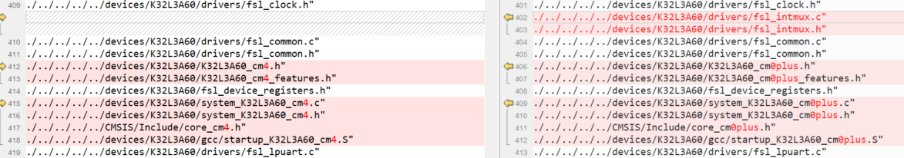
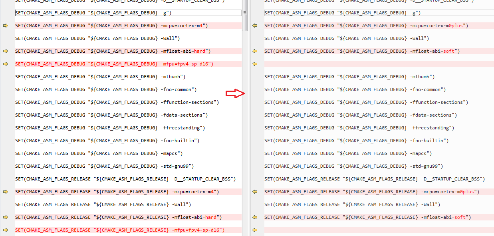
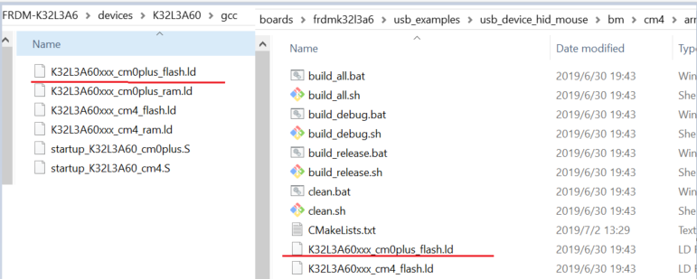
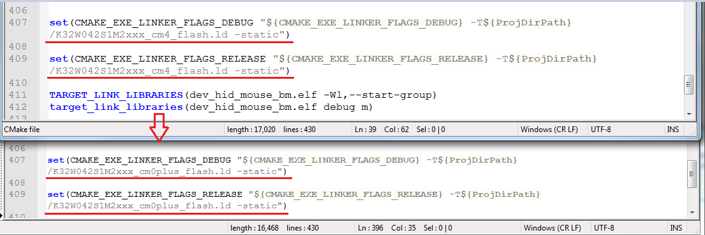
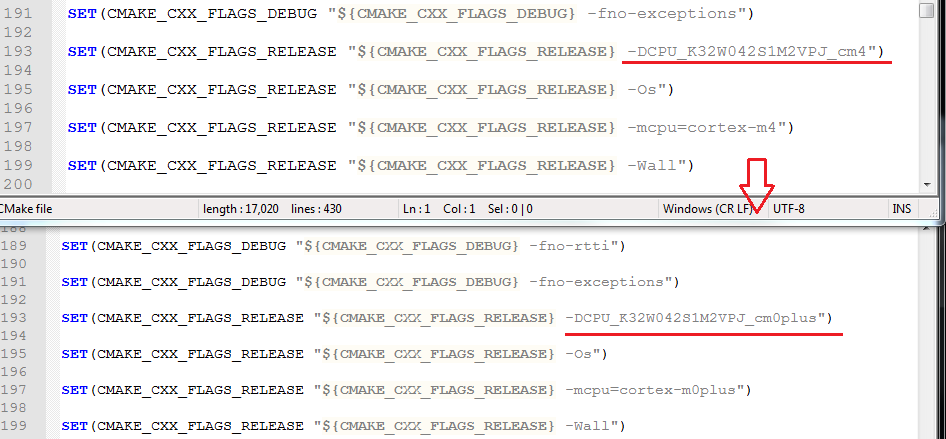
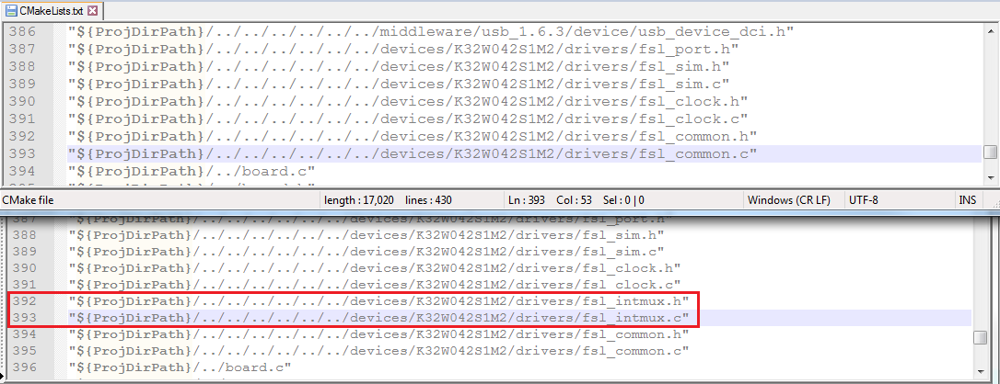
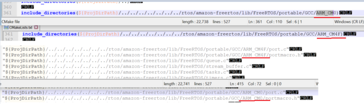

# ARMGCC

1.  Update startup and system file from M4 platform files to M0p platform files.

    Open the CMakeLists.txt of the example, such as FRDM-K32L3A6\\boards\\frdmk32l3a6\\usb\_examples\\usb\_device\_hid\_mouse\\bm\\armgcc\\ CMakeLists.txt

    The bellow picture shows how to change m4 project files to M0p project file.

    

2.  Open CMakeLists.txt.

    Replace all the CPU setting from cortex-m4 to cortex-m0plus.

    Replace all the ”-mfloat-abi=hard” to “-mfloat-abi=soft”

    Delete all “mfpu=fpv4-sp-d16”

    

3.  Change the linker configure file form M4 link file to M0p link file. The linker file path is devices\\ K32L3A60 folder.

    Copy K32L3A60xxx\_cm0plus\_flash.ld from FRDM-K32L3A6 \\devices\\ K32L3A60 \\gcc to the example project folder. Take usb\_device\_hid\_mouse as example.

    

4.  Modify the CMakeLists.txt.

    

5.  Change all the CPU MACRO from "CPU\_K32W042S1M2VPJ\_cm4" to "CPU\_K32W042S1M2VPJ\_cm0plus" in CMakeLists.txt.

    

6.  Add int-mux file to M0p project, as bellow

    Add FRDM-K32L3A6 \\devices\\K32W042 K32L3A60 S1M2\\drivers\\fsl\_intmux.c and fsl\_intmux.h files to project.

7.  Check the fsl\_intmux.c/ fsl\_intmux.h is in FRDM-K32L3A6 \\devices\\K32W042 K32L3A60 S1M2\\drivers folder.

    

8.  For freertos example. Update the freertos related portable file and include path from M4 to M0.

    Change all the source path and include path“Source/portable/GCC/ARM\_CM4F” to “Source/portable/GCC/ARM\_CM0”,

    

    After the above project configuration is complete, the m4 USB example project would be changed to M0p project. M0p example USB project can now be downloaded and debugged.

