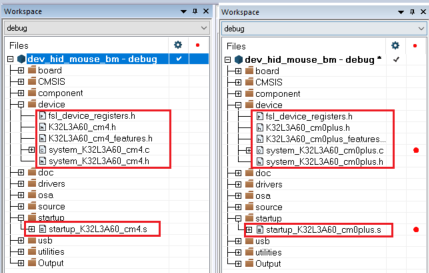
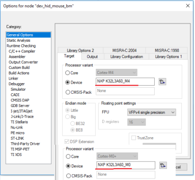
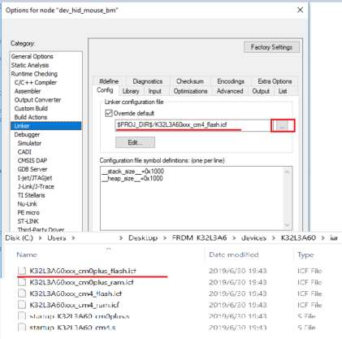
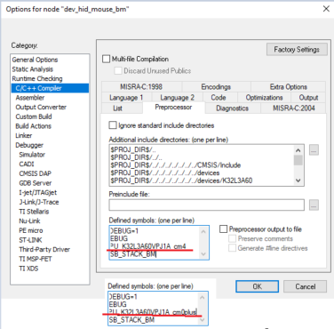
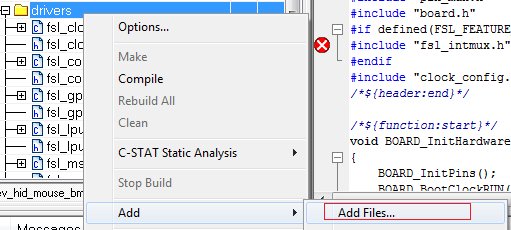
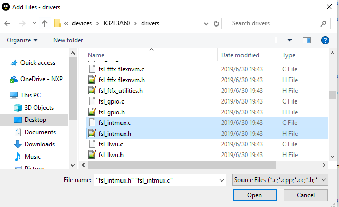
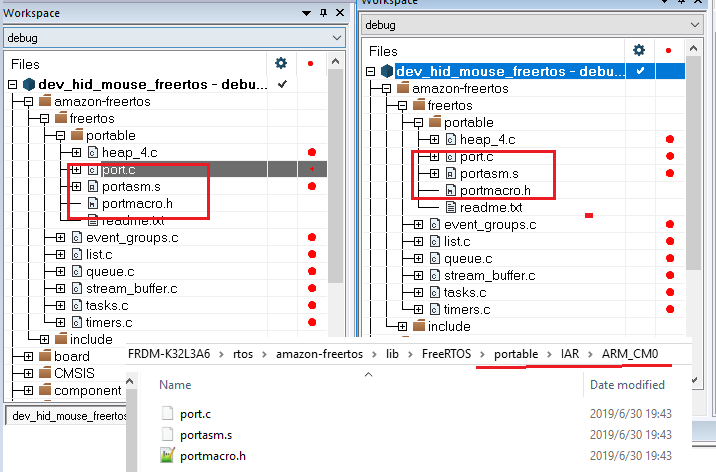
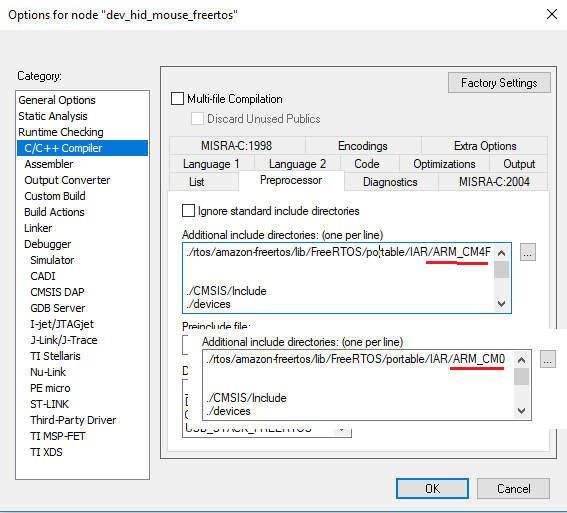

# IAR

1.  Update startup and system file from M4 platform files to M0p platform files. The files are available in folder: FRDM-K32L36\\devices\\K32L3A60. The bellow picture shows how to change m4 project files to M0p project file.

    

2.  Open M4 project in IAR. Right click, in option--\>General Options--\>target and update the CPU type form M4 to M0p.

    

3.  Again, in M4 project in IAR, in option--\>linker--\>config, change the linker configure file form M4 link file to M0p link file. The linker file path is devices\\ K32L3A60 folder.

    

4.  In M4 project in IAR, in option--\>c/c++ compiler--\>Preprocessor, change the CPU MACRO from "CPU\_K32W042S1M2VPJ\_cm4" to "CPU\_K32W042S1M2VPJ\_cm0plus".

    

5.  Add int-mux file to M0p project, driver \> add \> add files, as shown in the figure below

    

    Add FRDM-K32L3A6 \\devices\\ K32L3A60 \\drivers\\fsl\_intmux.c and fsl\_intmux.h files to project.

    

6.  In M4 project in IAR, in option C/C++ compiler \> Preprocessor. The file path “$PROJ\_DIR$/../../../../../../devices/ K32L3A60 /drivers” must be in M0p project setting.
7.  For freertos example, update the freertos related portable file and include path from M4 to M0.

    

    Update the include path:

    

    After the above project configuration is complete, the m4 USB example project would be changed to M0p project. M0p example USB project can now be downloaded and debugged.

