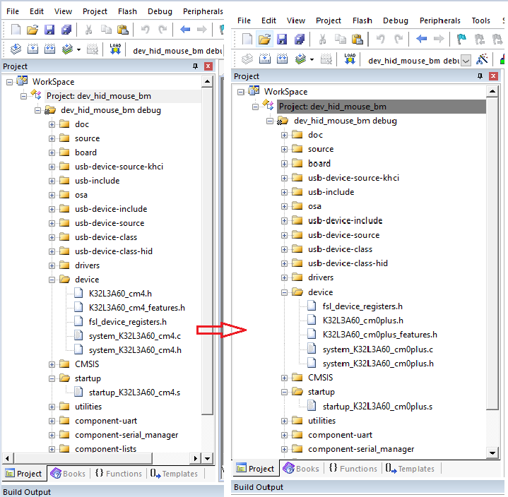
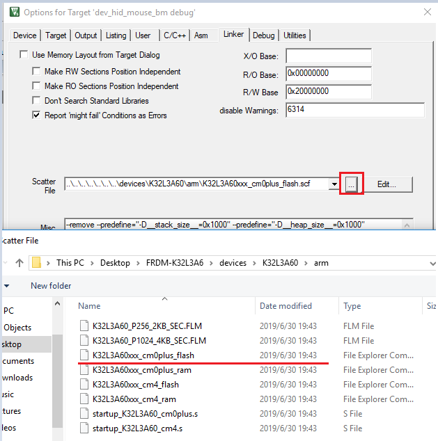
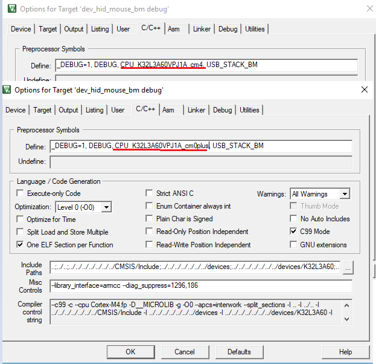
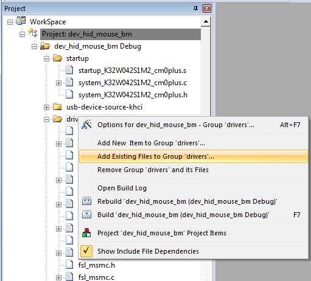
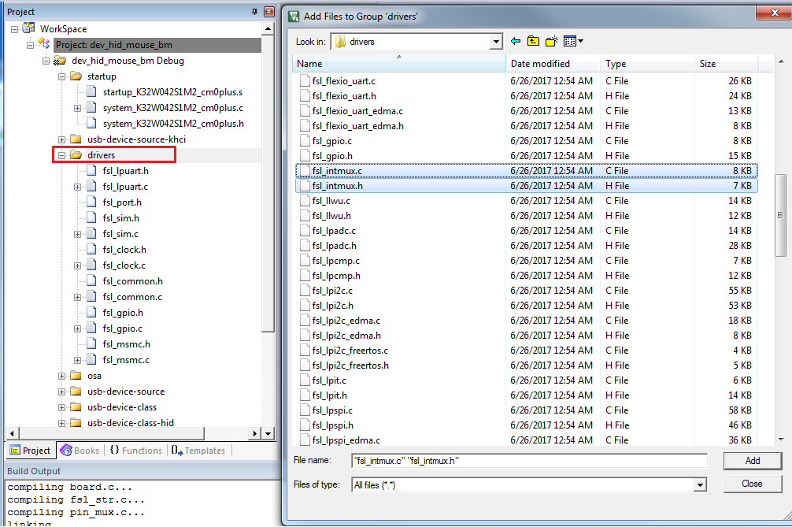
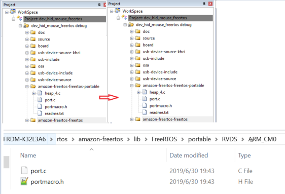
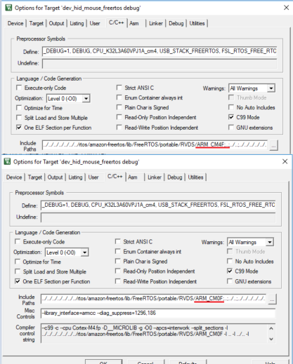

# MDK

1.  Change startup and system file from M4 platform files to M0p platform files. The below picture shows how to change m4 project files to M0p project file.

    The files are available in folder: FRDM-K32L3A6\\devices\\K32L3A60

    

2.  Open M4 project in MDK, in option \> Device, change the CPU type form M4 to M0p.

    

3.  Again in M4 project in MDK, in option--\>linker, change the linker configure file form M4 link file to M0p link file. The linker file path is devices\\K32L3A60 folder.

    

4.  In M4 project in MDK, in option \> C/C++ compiler, change the CPU MACRO from " CPU\_K32L3A60VPJ1A\_cm4" to "CPU\_K32L3A60VPJ1A\_cm0plus".

    

5.  Add int-mux file to M0p project, driver -add Exiting Files to Group ‘driver’, as shown in the image bellow

    

6.  Add FRDM-K32L3A6\\devices\\K32L3A60\\drivers\\fsl\_intmux.c and fsl\_intmux.h files to project.

    

7.  For freertos example. Update the freertos related portable file and include path from M4 to M0.

    

    Update the include path:

    

    After the above project configuration is complete, the m4 USB example project would be changed to M0p project. M0p example USB project can now be downloaded and debugged.

