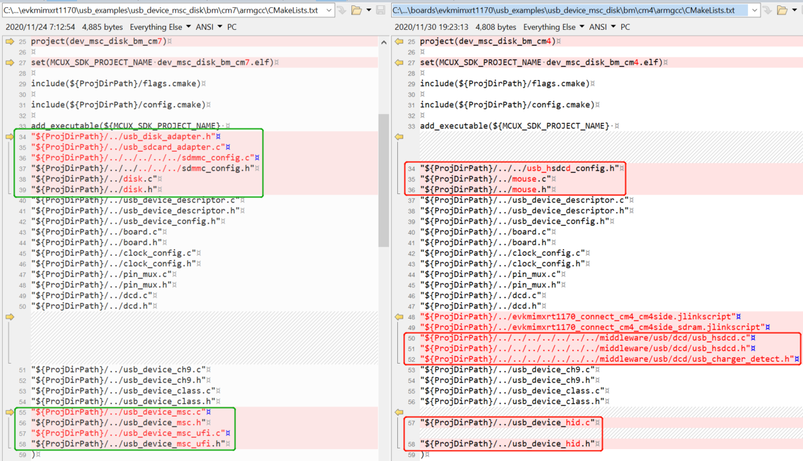
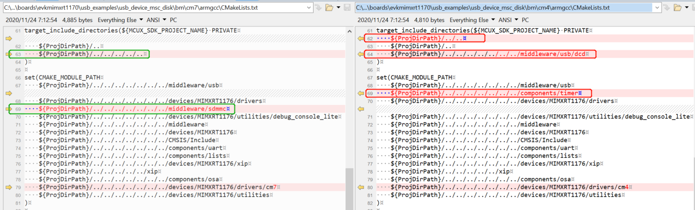
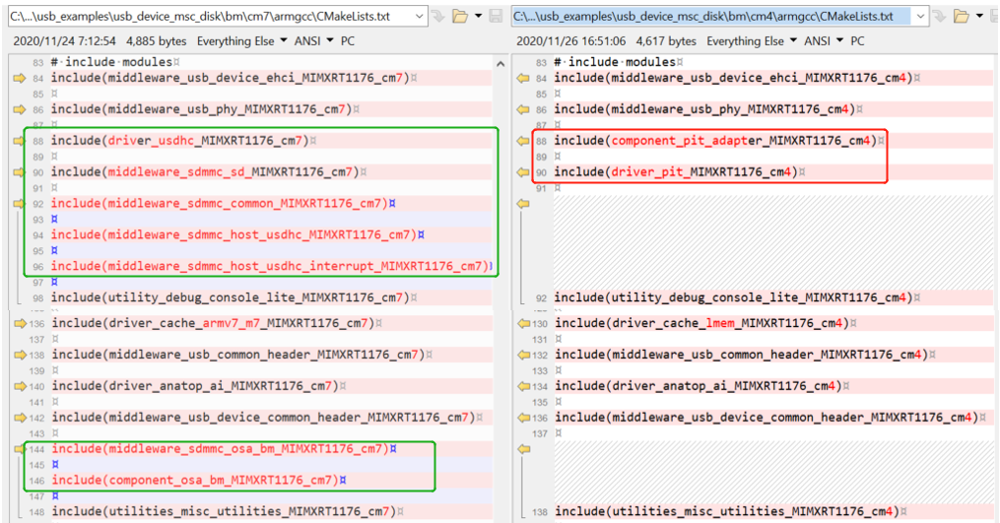
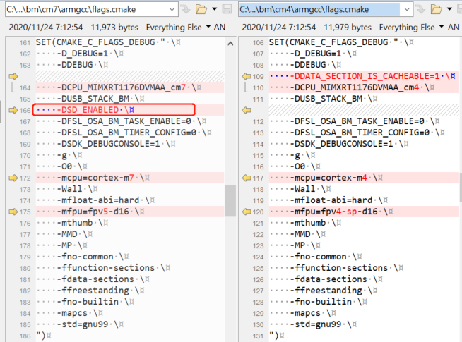

# ARMGCC

1.  **Create an RT1170 M4/RT1180 M7 project**
    1.  For RT1170, copy the *cm4* folder under *<install\_dir\>*

        */boards/evkmimxrt1170/usb\_examples/usb\_device\_hid\_mouse/bm/cm4* to the folder where the example must be enabled.

        In this case, copy *<install\_dir\>/boards/evkmimxrt1170/usb\_examples/usb\_device\_hid\_mouse/bm/cm4* to *<install\_dir\>/boards/evkmimxrt1170/usb\_examples/usb\_device\_msc\_disk/bm*.

        For RT1180, copy the *cm7* folder under *<install\_dir\>/boards/evkmimxrt1180/usb\_examples/usb\_device\_hid\_mouse/bm/cm7* to the folder where the example must be enabled.

        In this case, copy *<install\_dir\>/boards/evkmimxrt1180/usb\_examples/usb\_device\_hid\_mouse/bm/cm7* to *<install\_dir\>/boards/evkmimxrt1180/usb\_examples/usb\_device\_msc\_disk/bm*.

    2.  For RT1170, open the *CMakeLists.txt* of the example. The file is located under *<install\_dir\>/boards/evkmimxrt1170/usb\_examples/usb\_device\_msc\_disk/bm/cm4/ armgcc*.

        For RT1180, open the *CMakeLists.txt* of the example. The file is located under *<install\_dir\>/boards/evkmimxrt1180/usb\_examples/usb\_device\_msc\_disk/bm/cm7/ armgcc*.

    3.  For RT1170, search and replace all `dev_hid_mouse_bm_cm4` with `dev_msc_disk_bm_cm4`, and then save the files.

        For RT1180, search and replace all `dev_hid_mouse_bm_cm7` with `dev_msc_disk_bm_cm7`, and then save the files.

2.  **Rearrange source files**
    1.  For RT1170, open the *cm4* folder under *<install\_dir\>/boards/evkmimxrt1170/usb\_examples/usb\_device\_msc\_disk/bm/cm4* folder and delete all files with the `.c` and `.h` extension.

        For RT1180, open the *cm7* folder under *<install\_dir\>/boards/evkmimxrt1180/usb\_examples/usb\_device\_msc\_disk/bm/cm7* folder and delete all files with the `.c` and `.h` extension.

    2.  For RT1170, copy files with the `.c` and `.h` extension in the *cm7* folder under *<install\_dir\>/boards/evkmimxrt1170/usb\_examples/usb\_device\_msc\_disk/bm/cm7* to the *cm4* folder under *<install\_dir\>/boards/evkmimxrt1170/usb\_examples/usb\_device\_msc\_disk/bm/cm4*.

        For RT1180, copy files with the `.c` and `.h` extension in the *cm33* folder under *<install\_dir\>/boards/evkmimxrt1180/usb\_examples/usb\_device\_msc\_disk/bm/cm33* to the *cm7* folder under *<install\_dir\>/boards/evkmimxrt1180/usb\_examples/usb\_device\_msc\_disk/bm/cm7*.

        |

|

3.  **Rearrange project files**

    **Note:** The following steps are described for RT1170. However, these steps are also applicable for RT1180.

    1.  Open the *CMakeLists.txt* of the two examples respectively. The two files are respectively located under *<install\_dir\>/boards/evkmimxrt1170/usb\_examples/usb\_device\_msc\_disk/bm/cm7/armgcc* and *<install\_dir\>/boards/evkmimxrt1170/usb\_examples/usb\_device\_msc\_disk/bm/cm4/ armgcc*.
    2.  Search the **add\_executable** section in the *cm7* and *cm4* projects. Delete files that are in the `cm4` project but not `cm7`. Add files that are in the `cm7` project but not `cm4` to the `cm4` project.

        In this case, delete the files in red box and add the directories in the green box to the `cm4` project.

        |

|

4.  **Adjust project settings**

    **Note:** The following steps are described for RT1170. However, these steps are also applicable for RT1180.

    1.  Search the **target\_include\_directories**, **CMAKE\_MODULE\_PATH**, and **\# include modules** section one by one. Add macros that are in the `cm7` project but not `cm4` to the `cm4` project.

        In this case, remove the paths framed in the red box from the `cm4` project and add the directories framed in the green box.

        **Note:** Modify the include modules with the `cm7` suffix to `cm4`. For example, modify `driver_usdhc_MIMXRT1176_cm7` to `driver_usdhc_MIMXRT1176_cm4`.

        |

|

        |

|

    2.  Open the `flags.cmake` of the two examples respectively. The two files are respectively located in *<install\_dir\>/boards/evkmimxrt1170/usb\_examples/usb\_device\_msc\_disk/bm/cm7/armgcc* and *<install\_dir\>/boards/evkmimxrt1170/usb\_examples/usb\_device\_msc\_disk/bm/cm4/ armgcc*.
    3.  Search the **CMAKE\_C\_FLAGS\_DEBUG** section in the `cm4` and `cm7` projects. Compare the macros and add the macro that is in the `cm7` project but not `cm4` to the `cm4` project.

        In this case, add the *SD\_ENABLED* macro to the `cm4` project.

        |

|

With all above steps done, the RT1170 M7 project successfully changes to an M4 project and the M4 example USB project is available for downloading and debugging. The RT1180 M33 project successfully changes to an M7 project and the M7 example USB project is downloading and debugging.

