# IAR

1.  **Create an RT1170 M4/RT1180 M7 project**
    1.  For RT1170, copy the *cm4* folder under *<install\_dir\>/boards/evkmimxrt1170/usb\_examples/usb\_device\_hid\_mouse/bm/cm4* to the folder where the example must be enabled.

        In this case, copy the *cm4* folder to *<install\_dir\>/boards/evkmimxrt1170/usb\_examples/usb\_device\_msc\_disk/bm*.

        For RT1180, copy the *cm7* folder under *<install\_dir\>/boards/evkmimxrt1180/usb\_examples/usb\_device\_hid\_mouse/bm/cm7* to the folder where the example must be enabled.

        In this case, copy the *cm7* folder to *<install\_dir\>/boards/evkmimxrt1180/usb\_examples/usb\_device\_msc\_disk/bm*.

    2.  For RT1170, open the *iar* folder under *<install\_dir\>/boards/evkmimxrt1170/usb\_examples/usb\_device\_msc\_disk/bm/cm4/iar*.

        For RT1180, open the *iar* folder under *<install\_dir\>/boards/evkmimxrt1180/usb\_examples/usb\_device\_msc\_disk/bm/cm7/iar*.

    3.  For RT1170, change the filename `dev_hid_mouse_bm_cm4` to `dev_msc_disk_bm_cm4` respectively.

        For RT1180, change the filename `dev_hid_mouse_bm_cm7` to `dev_msc_disk_bm_cm7` respectively.

        |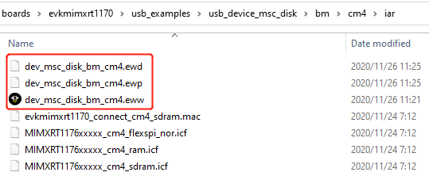

|

    4.  For RT1170, open the `dev_msc_disk_bm_cm4.eww` and `dev_msc_disk_bm_cm4.ewp` files with a text editor, such as notepad, notepad++, sublime or Visual studio code.

        For RT1180, open the `dev_msc_disk_bm_cm7.eww` and `dev_msc_disk_bm_cm7.ewp` files with a text editor, such as notepad, notepad++, sublime or Visual studio code.

    5.  For RT1170, search and replace all `dev_hid_mouse_bm_cm4` with `dev_msc_disk_bm_cm4`, and then save the files.

        |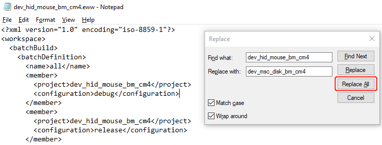

|

        |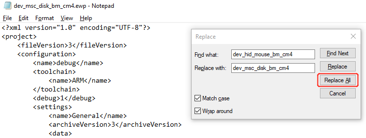

|

        For RT1180, search and replace all `dev_hid_mouse_bm_cm7` with `dev_msc_disk_bm_cm7`, and then save the files.

        |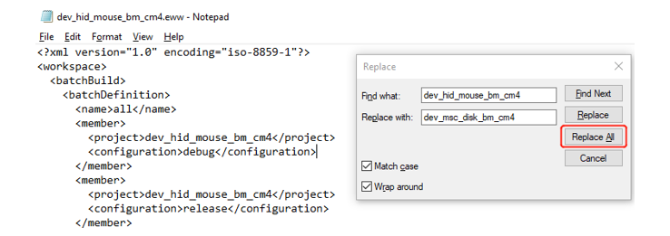

|

        |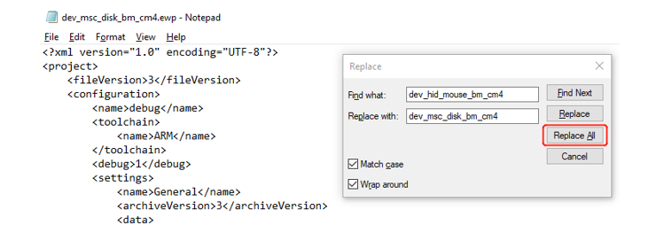

|

2.  **Rearrange source files**
    1.  For RT1170, open the *cm4* folder under *<install\_dir\>/boards/evkmimxrt1170/usb\_examples/usb\_device\_msc\_disk/bm/cm4*, and delete all files with the `.c` and `.h` extension.

        For RT1180, open the *cm7* folder under *<install\_dir\>/boards/evkmimxrt1180/usb\_examples/usb\_device\_msc\_disk/bm/cm7*, and delete all files with the `.c` and `.h` extension.

    2.  For RT1170, copy files with the `.c` and `.h` extension in the *cm7* folder under *<install\_dir\>/boards/evkmimxrt1170/usb\_examples/usb\_device\_msc\_disk/bm/cm7* to the *cm4* folder under *<install\_dir\>/boards/evkmimxrt1170/usb\_examples/usb\_device\_msc\_disk/bm/cm4*.

        |

|

        For RT1180, copy files with the `.c` and `.h` extension in the *cm33* folder under *<install\_dir\>/boards/evkmimxrt1180/usb\_examples/usb\_device\_msc\_disk/bm/cm33* to the *cm7* folder under *<install\_dir\>/boards/evkmimxrt1180/usb\_examples/usb\_device\_msc\_disk/bm/cm7*.

        |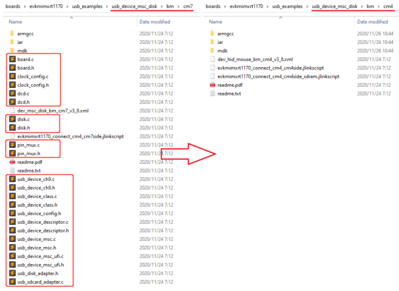

|

3.  **Rearrange project files**

    **Note:** The following steps are described for RT1170. However, these steps are also applicable for RT1180.

    1.  Open `dev_msc_disk_bm_cm7`and `dev_msc_disk_bm_cm4` IAR project respectively. The two workspaces are respectively located under *<install\_dir\>/boards/evkmimxrt1170/usb\_examples/usb\_device\_msc\_disk/bm/cm7/iar* and *<install\_dir\>/boards/evkmimxrt1170/usb\_examples/usb\_device\_msc\_disk/bm/cm4/iar*.
    2.  Compare the whole project directory. Find file groups that are in the `cm7` project but not `cm4` and add them to the `cm4` project.
    3.  Compare the two groups with the same name. Delete files that are in the `cm4` project but not `cm7`. Find files that are in the `cm7` project but not `cm4` and add them to the `cm4` project.
    In this case,

    -   For the `board` group, add `sdmmc_config` source files to `board` group in the `cm4` project.

        |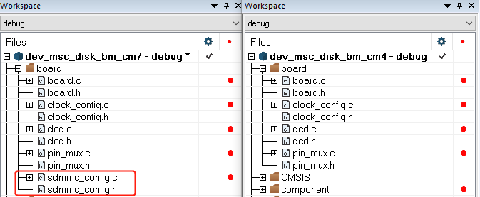

|

    -   For the `component` group, delete files associated with timer from `cm4` project and add no files.

        |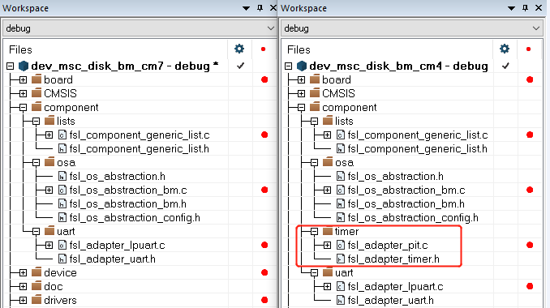

|

    -   For the `drivers` group, delete `fsl_pit` source files from the `cm4` project and add `fsl_usdhc` source files to the `cm4` project.

        |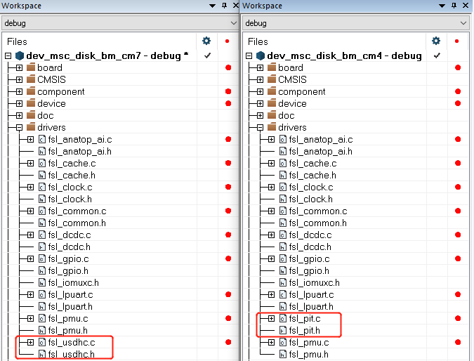

|

    -   For the `sdmmc` group, there is not `sdmmc` group in the `cm4` project. Add `sdmmc` group and its children to the `cm4` project.

        |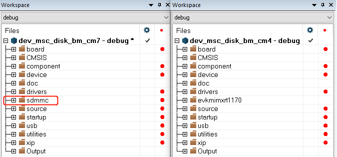

|

    -   For the `source` group, delete the files in the `cm4` source group and add the files under *<install\_dir\>/boards/evkmimxrt1170/usb\_examples/usb\_device\_msc\_disk/bm/cm4* with the same name as in the `cm7` project.

        |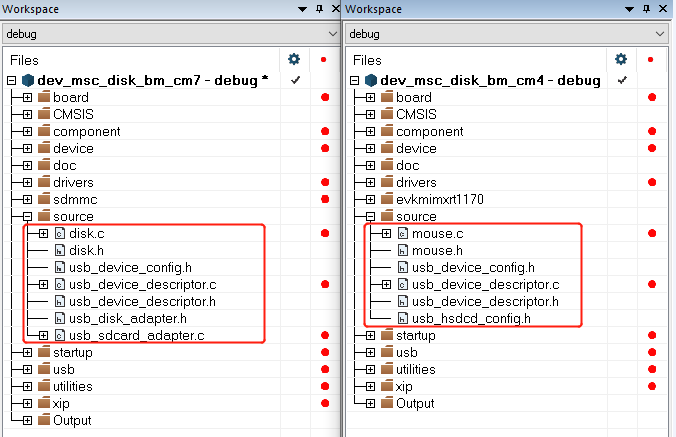

|

    -   For the `usb` group, replace the `hid` group and its children in the `cm4` project with `msc` group in the `cm7` project and delete the `dcd` group.

        |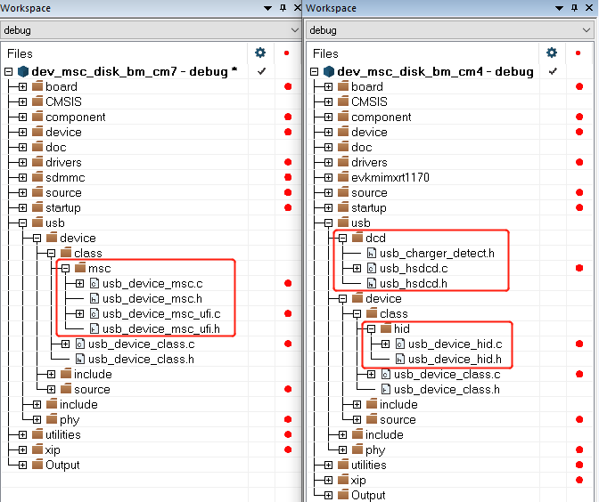

|

4.  **Adjust project settings**

    **Note:** The following steps are described for RT1170. However, these steps are also applicable for RT1180.

    1.  Compare the macro in the project settings: **Option** - **C/C++ compiler** \> **Preprocessor**. Add the macro that is in the `cm7` project but not `cm4` to the `cm4` project.

        In this case, add the `SD_ENABLED` macro to the `cm4` project.

        |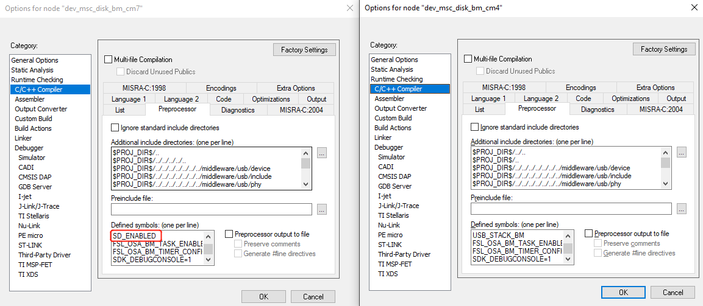

|

    2.  Change the include directories in the project settings, by clicking **Option** \> **C/C++ compiler** \> **Preprocessor**, according to the changes of project files.

        In this case, delete the directories framed in red and add the directories in green.

        |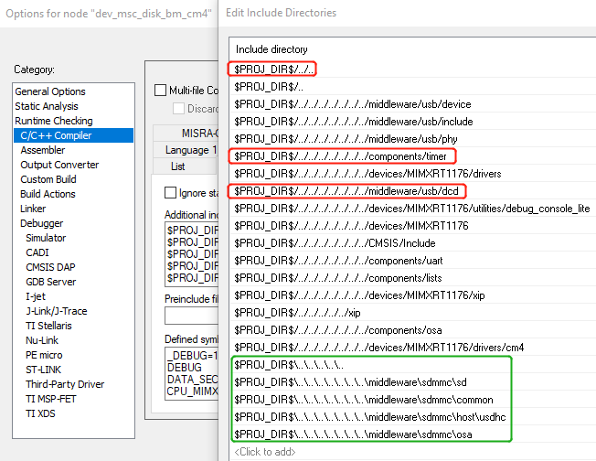

|

With all above steps done, the RT1170 M7 project successfully changes to an M4 project and the M4 example USB project is available for downloading and debugging. The RT1180 M33 project successfully changes to an M7 project and the M7 example USB project is downloading and debugging.

