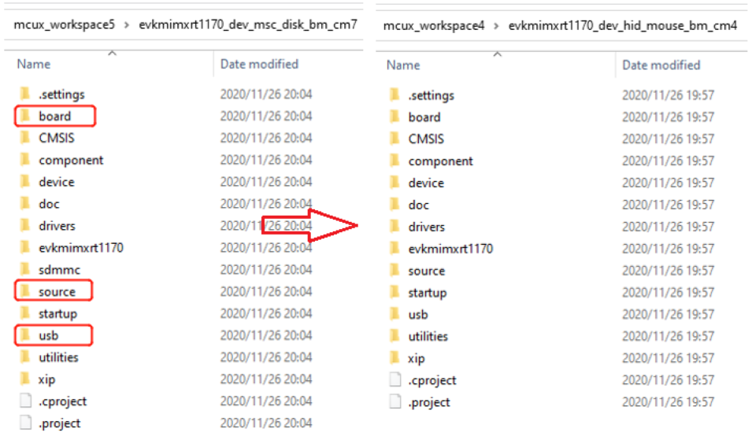
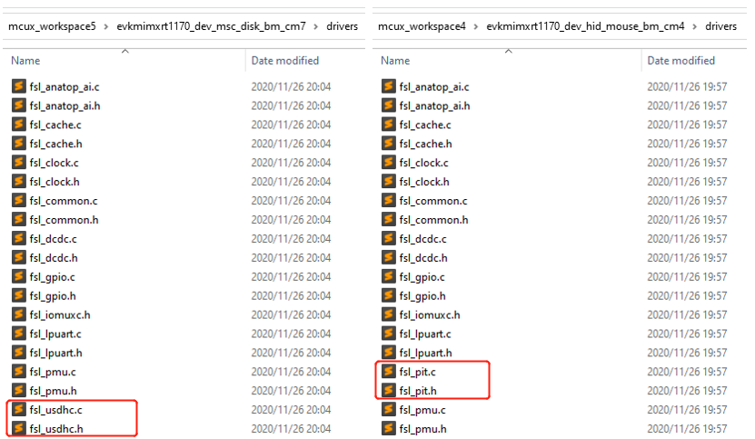
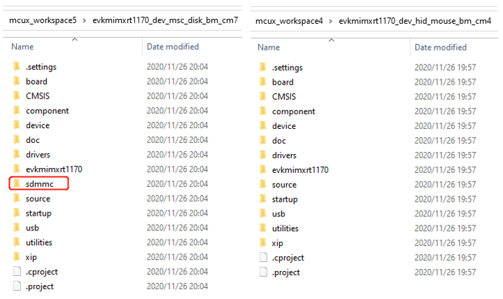
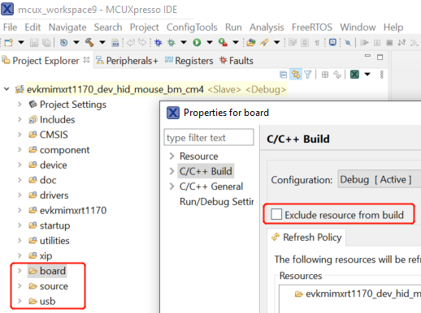
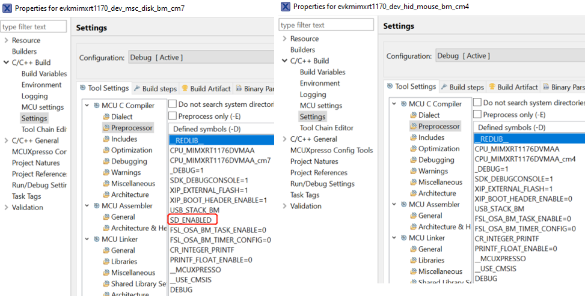
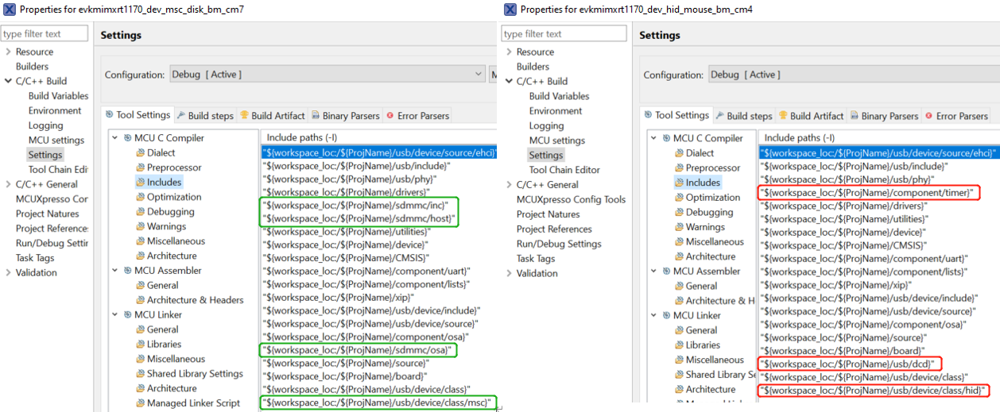
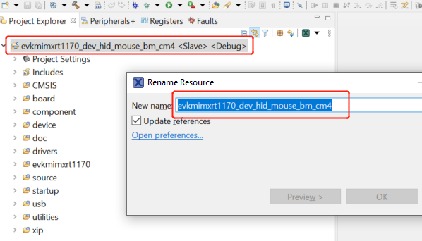

# MCUXpresso IDE

1.  **Rearrange source files**

    1.  For RT1170, import `dev_msc_disk_bm_cm7` and `dev_hid_mouse_bm_cm4` example. For RT1180, import `dev_msc_disk_bm_cm33` and `dev_hid_mouse_bm_cm4` example.
    2.  Open the directory of the two examples in the file explorer.
    3.  For RT1170, compare the whole project directory and add the folders that are in the `cm7` project but not `cm4` to the `cm4` project. For RT1180, compare the whole project directory and add the folders that are in the `cm33` project but not `cm7` to the `cm7` project.
    4.  Compare the two folders. For RT1170, delete the files that are in the `cm4` project but not `cm7` and add the files that are in the `cm7` project but not `cm4` to the `cm4` project. For RT1180, delete the files that are in the `cm7` project but not `cm33` and add the files that are in the `cm33` project but not `cm7` to the `cm7` project.
    In the RT1170 case,

    -   For the `board`, `source`, and `usb` folders, replace them in the `cm4` project with the ones in the `cm7` directory.

        |

|

    -   For the `component` folder, delete the `timer` folder in the `cm4` directory.

        |

|

    -   For the `drivers` folder, delete `fsl_pit` source files in the `cm4` project and add `fsl_usdhc` source files to the `cm4` directory.

        |

|

    -   For the `sdmmc` folder, copy it to the `cm4` project.

        |

|

2.  **Rearrange project files**

    After the source files are updated, the project files are loaded to the `cm4` project of RT1170 or the `cm7` project of RT1180 automatically. No manual updates to the project files are required.

    Due to the deletion in the first step, for the *board*, *source* and *usb* folders, an option must be deleted in the properties. Right click **board** -\> **properties** -\> **C/C++build** and uncheck **Exclude resource from build**. Perform the same operation in the **source** and **usb** folders. Take RT1170 as an example:

    |

|

3.  **Adjust project settings**

    **Note:** The following steps are described for RT1170. However, these steps are also applicable for RT1180.

    1.  Compare the macro in the project settings, by clicking **Properties** -\> **C/C++ Build** -\> **Setting** -\> **MCU C Compiler** -\> **Preprocessor**. Add the macro that is in the `cm7` project but not in `cm4` to the `cm4` project.

        In this case, the macro is `SD_ENABLED`.

        |

|

    2.  Change the include paths in the project settings, by clicking **Properties** -\> **C/C++ Build** -\> **Setting** -\> **MCU C Compiler** -\> **Includes**, according to the changes of project files.

        In this case, delete the paths framed in the red box and add the paths in the green box.

        |

|

4.  **Change project name**
    1.  Right-click **project name** \> **rename**, change the filename `dev_hid_mouse_bm_cm4` to `dev_msc_disk_bm_cm4`, and then click **OK**.

        |

|

With all above steps done, the RT1170 M7 project successfully changes to an M4 project and the M4 example USB project is available for downloading and debugging. The RT1180 M33 project successfully changes to an M7 project and the M7 example USB project is downloading and debugging.

