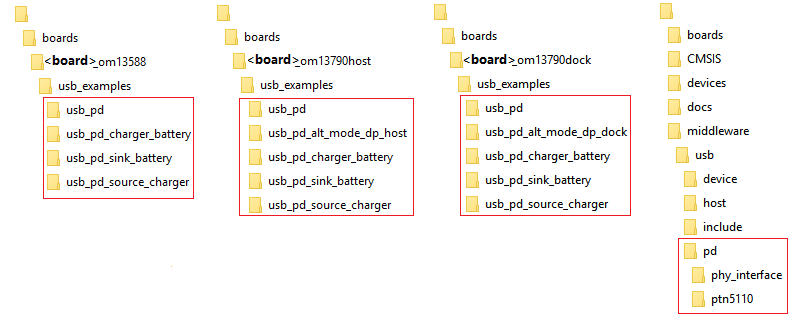

# Folder structure

The folder structure is shown below.

|

|

The following table provides information regarding the structure and description.

|Folder|Description|
|------|-----------|
|*boards/* *CMSIS/*

 *devices/*

 *docs/*

 *middleware/*

 *rtos/*

 *tools/*

|MCUXpresso SDK directories.|
|*boards/<board\>/usb\_examples/*|USB Type-C Power Delivery demos’ projects.|
|*middleware/usb/pd*|USB Type-C Power Delivery source code.|

**Note:** See the detailed description about the API of the MCUXpresso USB Type-C PD stack in *MCUXpresso SDK USB Type-C PD Stack Reference Manual* \(document MCUXUSBPDAPIRM\) in *docs/usb* folder.

**Parent topic:**[Software](../topics/software.md)

