# Hardware re-work

The following table provides information regarding I2C selection.

| |`I2C_0`|`I2C_1`|
|::|:-----:|:-----:|
|FRDM-K22F||√|
|FRDM-K64F|√||
|FRDM-KL27Z|√||
|FRDM-KL28Z||√|
|FRDM-KL32L2A4S| |√|
|IMXRT1050-EVKB||√|
|LPCXpresso54018|√||
|LPCXpresso54114|√||
|LPCXpresso54608|√||
|LPCXpresso55S16|√||
|LPCXpresso55S28|√||
|LPCXpresso55S69|√||
|MIMXRT1015-EVK|√||
|MIMXRT1020-EVK|√||
|MIMXRT1040-EVK|√| |
|MIMXRT1050-EVK||√|
|MIMXRT1060-EVK|√||
|MIMXRT1064-EVK|√||
|MIMXRT1170-EVK|√||
|MIMXRT685-EVK|√||
|MC56F83000-EVK|√||
|MIMXRT1060-EVKB|√| |
|MIMXRT1160-EVK|√| |
|MIMXRT595-EVK|√| |
|LPCXpresso55S36|√| |
|MIMXRT685-AUD-EVK|√| |
|MIMXRT1170-EVKB|√| |

**Note:**

-   For om13588, I2C\_0 means placing 1-2 for jumper J11 and J12.
-   For om13588, I2C\_1 means placing 2-3 for jumper J11 and J12.
-   For om13790host and om13790dock, I2C\_0 means placing 1-2 for jumper J14 and J15.
-   For om13790host and om13790dock, I2C\_1 means placing 2-3 for jumper J14 and J15.

## LCPXpresso55S28: None {#GUID-55FB7531-3AC6-4817-869A-82A9BF9DAC37 .section}

The connection state is as follows:

|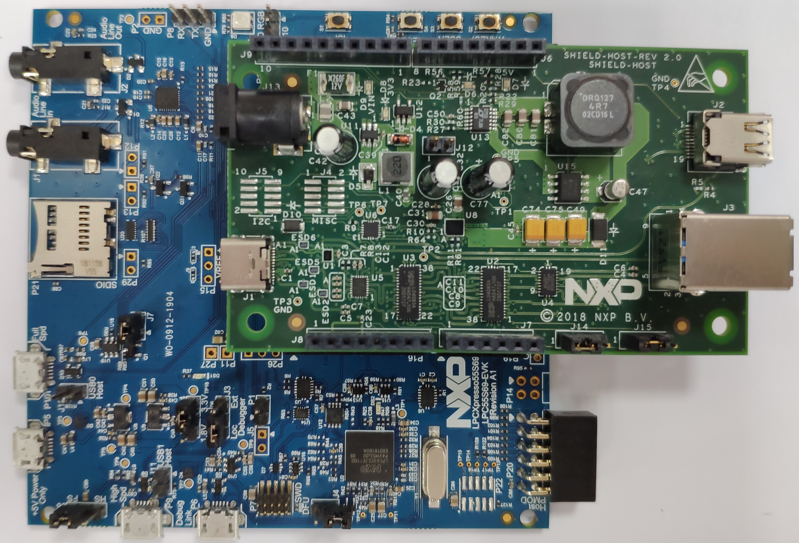

|

## LPCXpresso54114: None {#GUID-C17E255B-BDB5-4D82-A022-3DC3530647D6 .section}

The connection state is as follows:

|

|

## LPCXpresso54018 and LPCXpresso54608: {#GUID-95D1B63B-5C9E-4E6F-A74E-3937BA9892ED .section}

Connect the USBPD-C-SHIELD board to the Arduino headers in the LPCXpresso54608 evaluation board.

The PTN5110 interrupt signal \(nALERT\) is connected to the Arduino D4 pin receptacle. The software architecture requires nALERT to be routed to an interrupt enabled IO. The LPCXpresso54608 D4 input pin PIO4\_7 does not have interrupt functionality.

To work around this, use a blue wire connection between J404-1 and J403-8 for shield board om13588, between J9-1 and J6-8 for shield host board om13790host to use the PIO1\_22 interrupt capable input.

The connection state is as follows:

|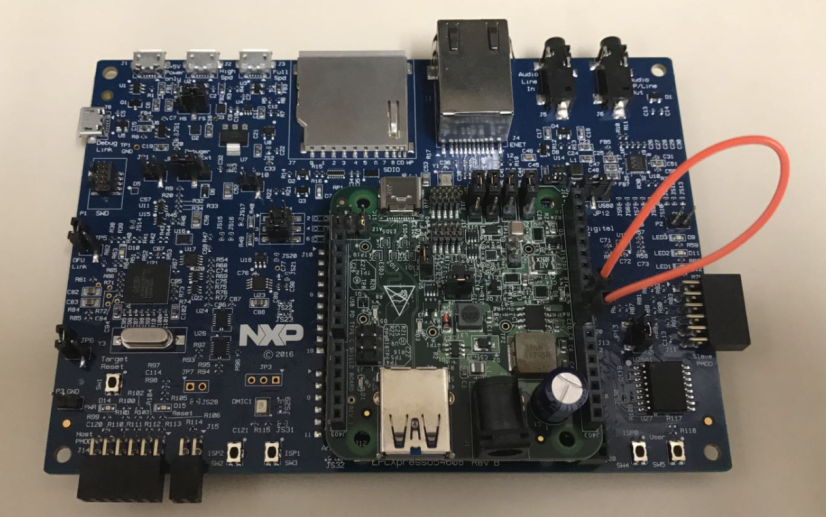

|

## LPCXpresso55S69: None {#GUID-555587E0-AF00-4CA4-B127-B43B0FFCF9DF .section}

The connection state is as follows:

|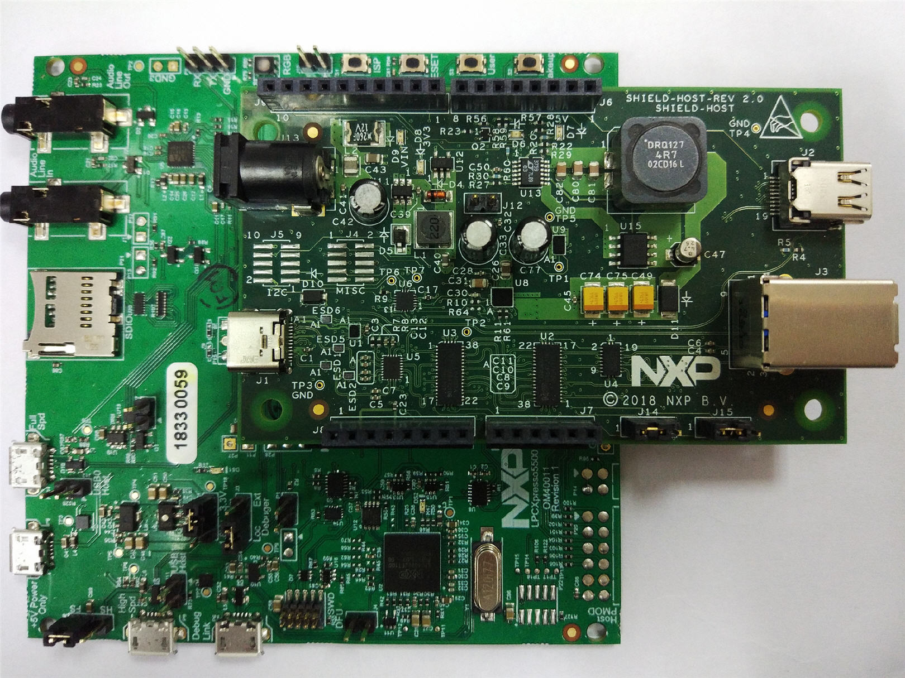

|

## FRDM-KL27Z: None {#GUID-FD35582C-C265-42CA-8CC3-C9560F178E06 .section}

The connection state is as follows:

|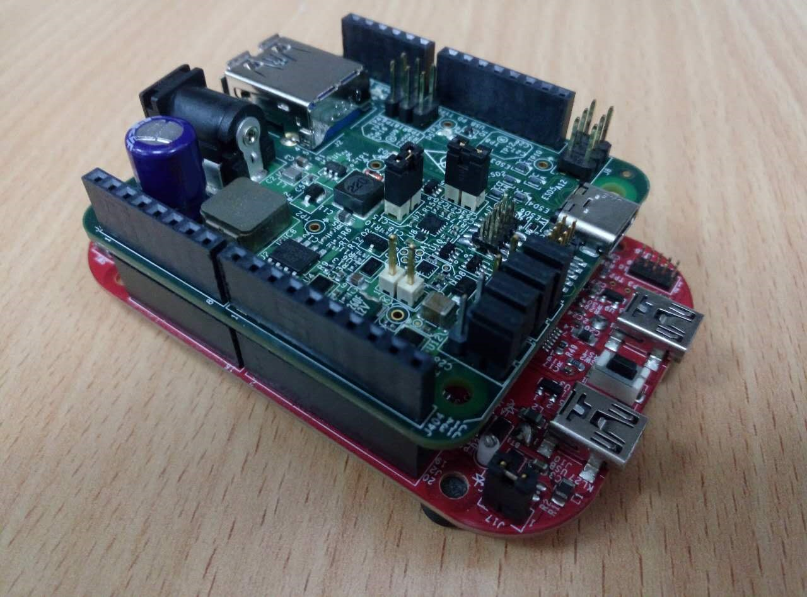

|

## FRDM-K22F: None {#GUID-D8BF3371-9166-49CA-87B6-56847BDAF86D .section}

|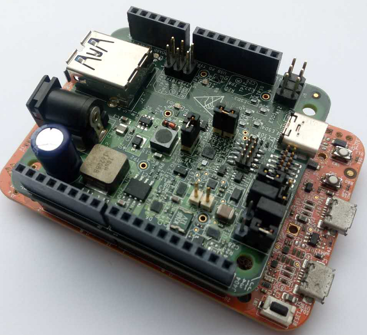

|

## FRDM-K64F: None {#GUID-1D85BD62-E0F5-4F47-BBF1-2AAE596C3DB6 .section}

|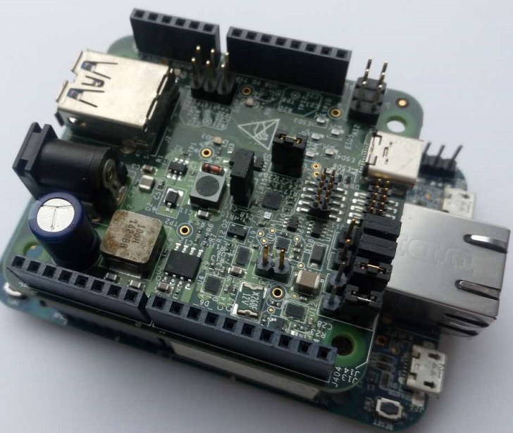

|

## FRDM-KL28Z: None {#GUID-9C554B54-C266-4735-A9C3-457E08E8E95E .section}

The connection state is as follows:

|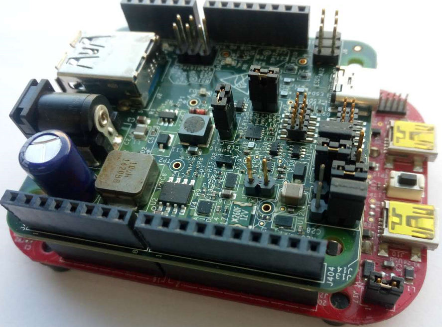

|

## MIMXRT1050-EVK and IMXRT1050-EVKB: None {#GUID-F092A7C0-D752-4FE4-B125-6F0BCD2EFB21 .section}

The connection state is as follows:

|

|

## MIMXRT1020-EVK: None {#GUID-C66FEEBF-20B9-40B3-B377-6CF518F027AD .section}

The connection state is as follows:

|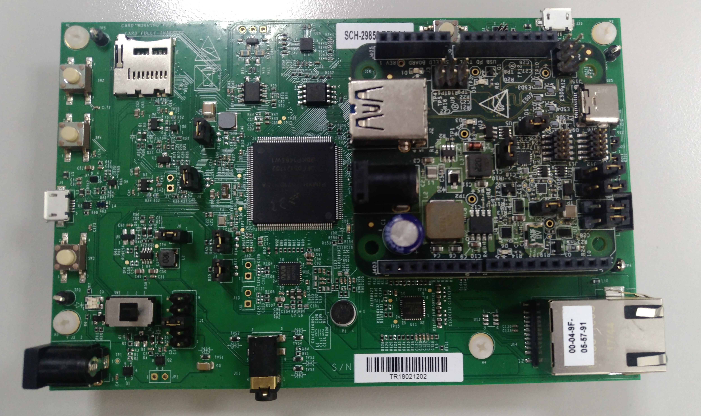

|

## MIMXRT1060-EVK: None {#GUID-A9B337EC-5065-4AFD-B637-4AFCD3A16C9C .section}

The connection state is as follows:

|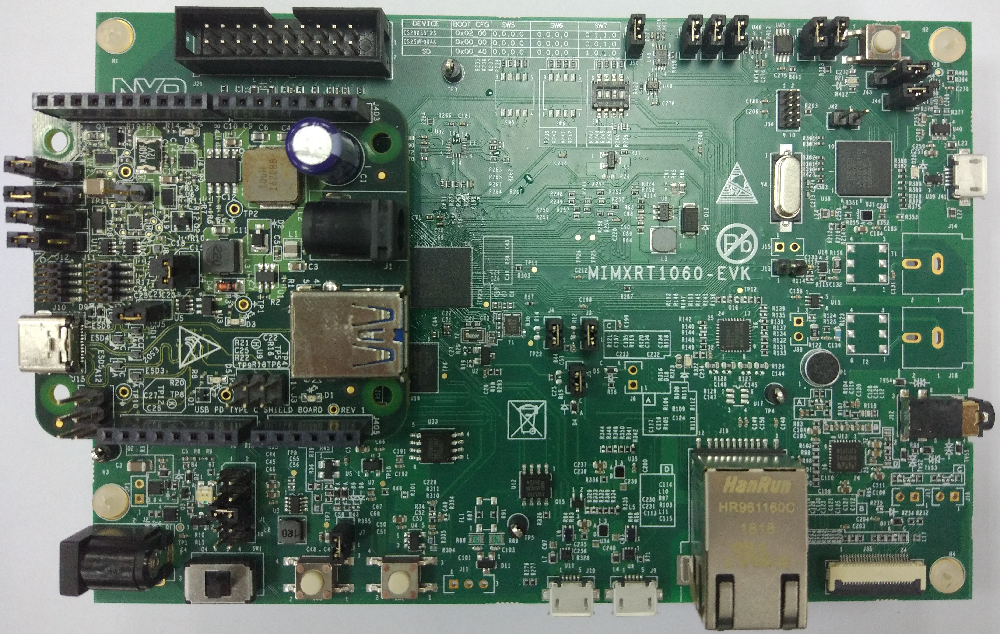

|

## MIMXRT1064-EVK: None {#GUID-3E88740D-BDF3-4968-8946-EB1A4688F550 .section}

The connection state is as follows:

|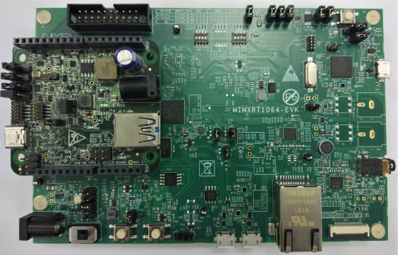

|

**Note:** Before powering up, verify the USB Type-C shield is pushed all the way into the Arduino header with good contact. Make sure there are no unintentional shorts \(like jumper, blue wires\) between the USB Type-C Shield board and the main development board.

## MIMXRT685-EVK: None {#GUID-8E4B171A-BDF1-4DE5-B3B0-7CA7DBDECF9D .section}

The connection state is as follows:

|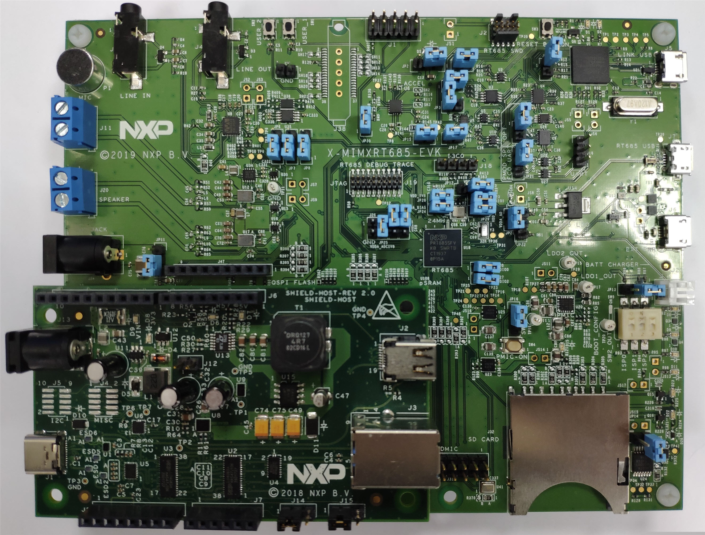

|

## MIMXRT1015-EVK: None {#GUID-8B9270E6-AC70-4D85-89E9-937801295648 .section}

The connection state is as follows:

|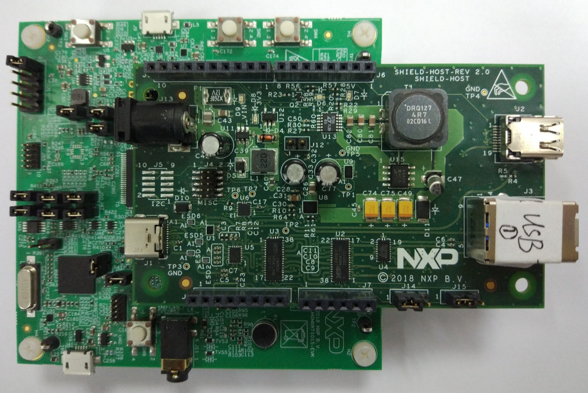

|

## MIMXRT1170-EVK: None {#GUID-4612B680-76C1-4B81-923C-C8EAB43C4763 .section}

The connection state is as follows:

|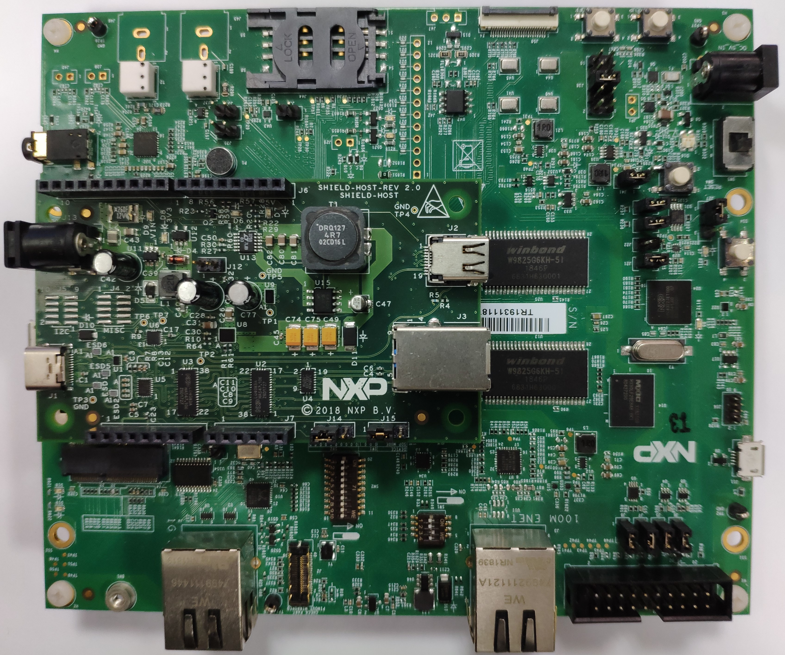

|

## FRDM-KL32L2A4S: None {#GUID-47EEF23B-9A4E-4692-B317-B2A48325736B .section}

The connection state is as follows:

|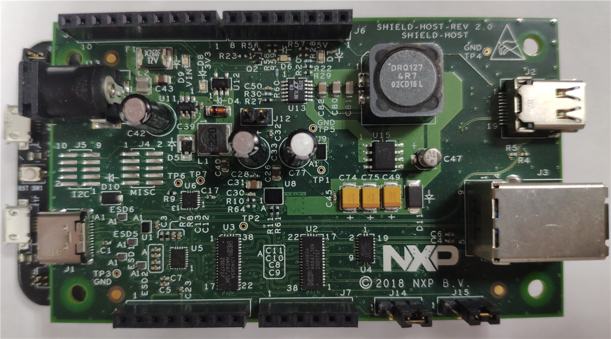

|

## LPCXpresso55S16: None {#GUID-68703EDB-541A-47A3-BB0B-EFEF9E046947 .section}

The connection state is as follows:

|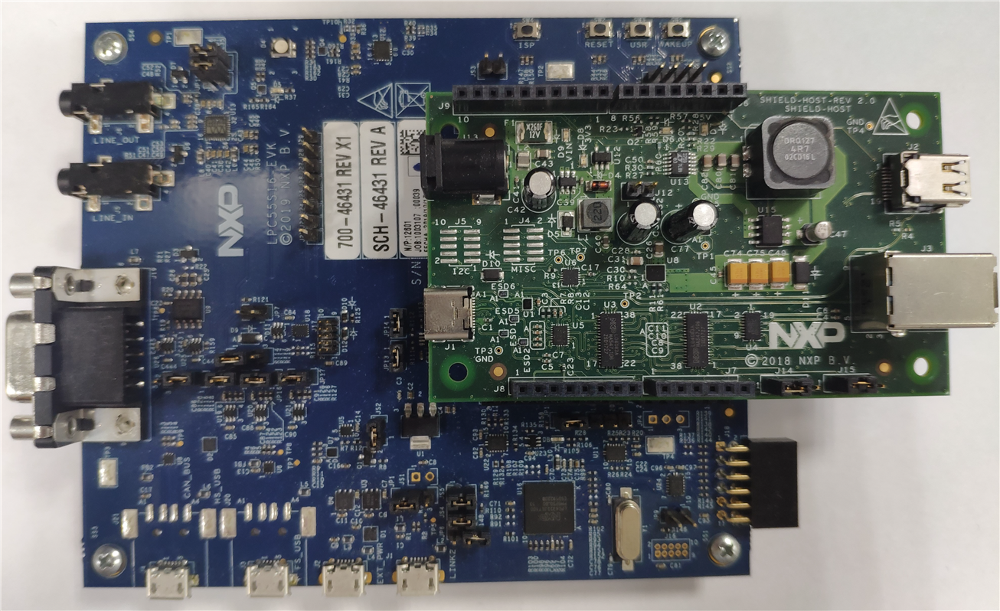

|

## MC56F83000-EVK: None {#GUID-6B058003-4590-4CC0-A9B3-ECC0B78ADE2D .section}

The connection state is as follows:

|

|

## MIMXRT1060-EVKB: None {#GUID-BAD .section}

The connection state is as follows:

|

|

## MIMXRT1160-EVK: None {#GUID-117F .section}

The connection state is as follows:

|

|

## MIMXRT595-EVK: None {#GUID-059D .section}

The connection state is as follows:

|

|

## LPCXpresso55S36: None {#GUID-059D2 .section}

The connection state is as follows:

|

|

## MIMXRT685-AUD-EVK: None {#GUID-9BA108DC-9FFF-4D86-85D3-B64DBB1B5CF2 .section}

The connection state is as follows:

|

|

**Parent topic:**[Hardware](../topics/hardware.md)

