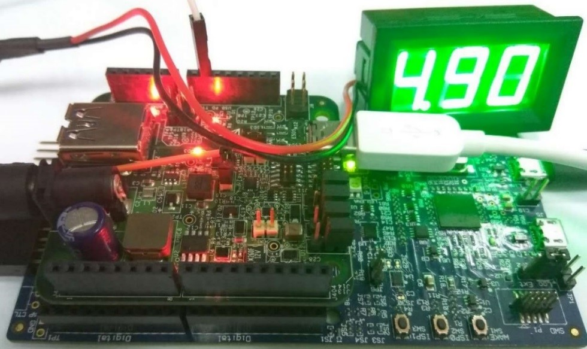
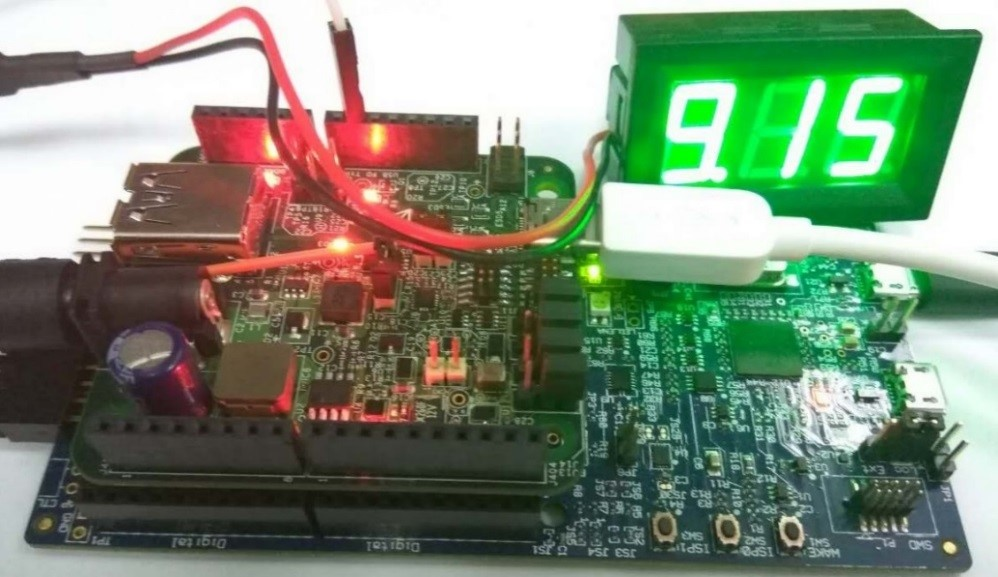

# Request from original sink role

1.  Connect a USB Type-C cable between two boards. One works as a sink and one works as a source. You can see it through the debug console.
2.  Connect a voltmeter to VBus \(J5\) of the sink role board. The voltmeter at the sink role shows approximately 5 V.

    |

|

3.  Press “Power request switch ” for about 3 seconds to make 9 V request. After the request is completed successfully, the voltmeter shall show 9 V.

    |

|

4.  Immediately press “Power request switch” to make 5 V request. After the request is completed successfully, the voltmeter shows approximately 5 V.

    |

|

**Parent topic:**[Demo setup](../topics/demo_setup.md)

