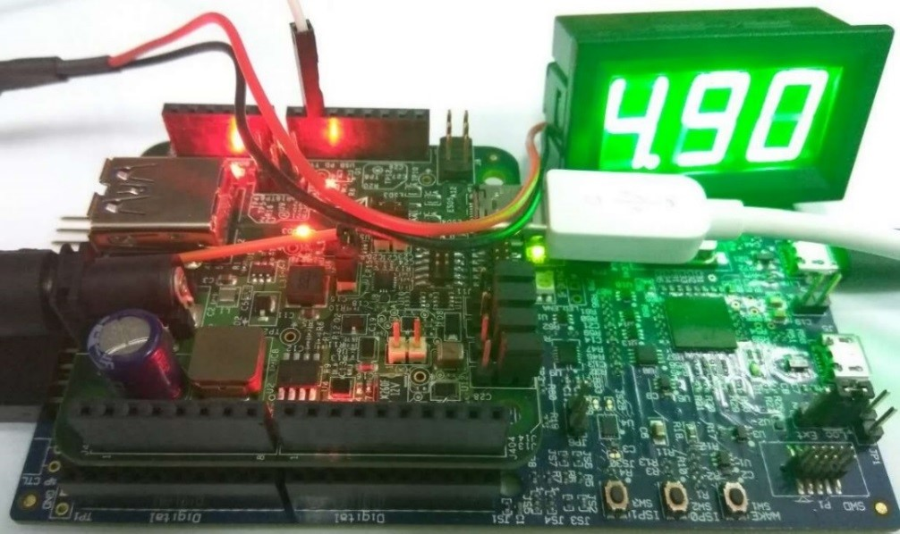
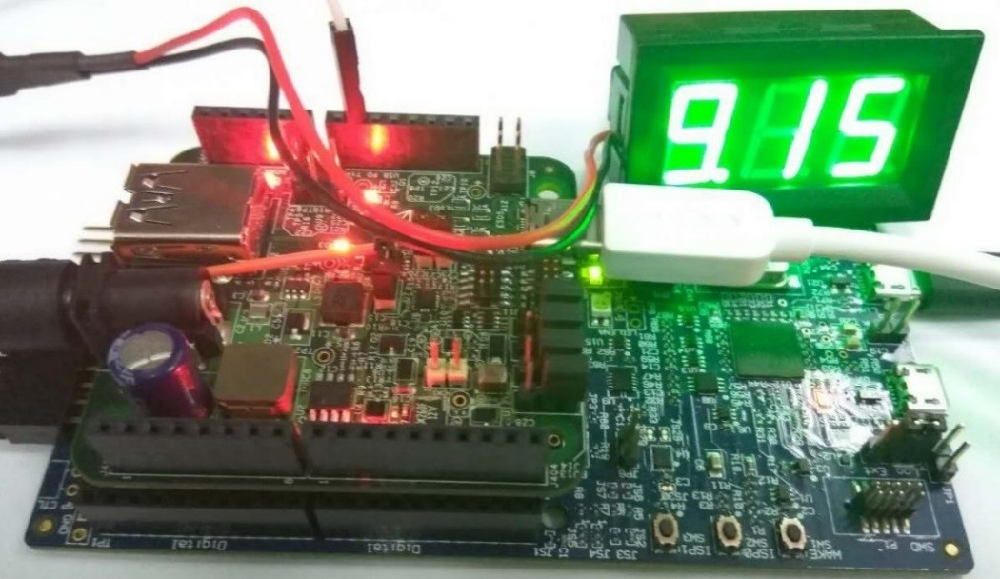
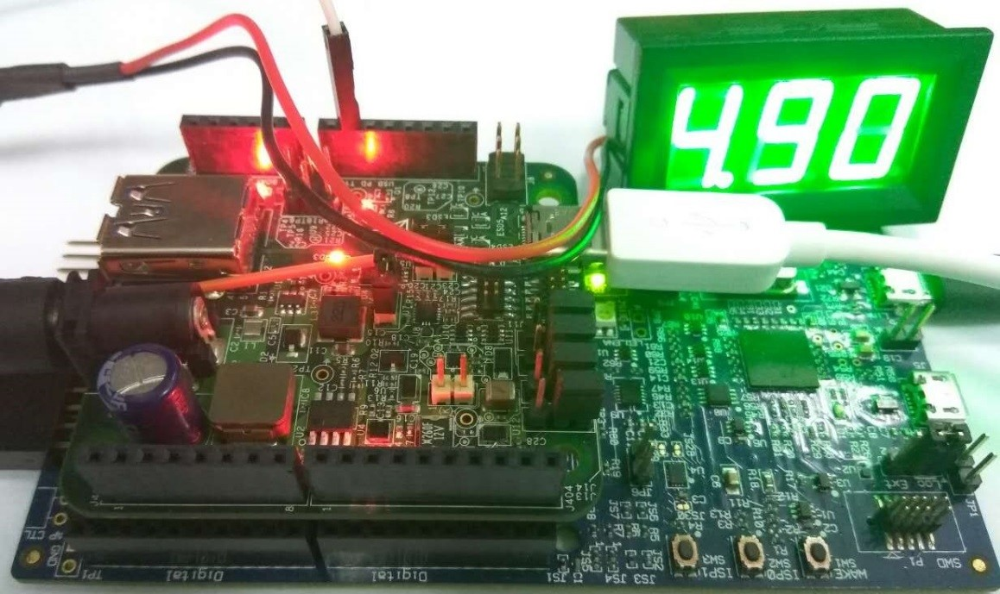

# Request from original source role

1.  Connect a voltmeter to VBus \(J5\) of the new sink role board. After the power role swap, the original source role becomes the sink role. The voltmeter at the source role shows approximately 5 V.

    |

|

2.  Press the “Power request switch ” for about 3 seconds to make 9 V request. After the request is completed successfully, the voltmeter shows approximately 9 V.

    |

|

3.  Immediately press the “Power request switch ” to make 5 V request. After the request is completed successfully, the voltmeter shows approximately 5 V.

    |

|

**Parent topic:**[Demo setup](../topics/demo_setup.md)

