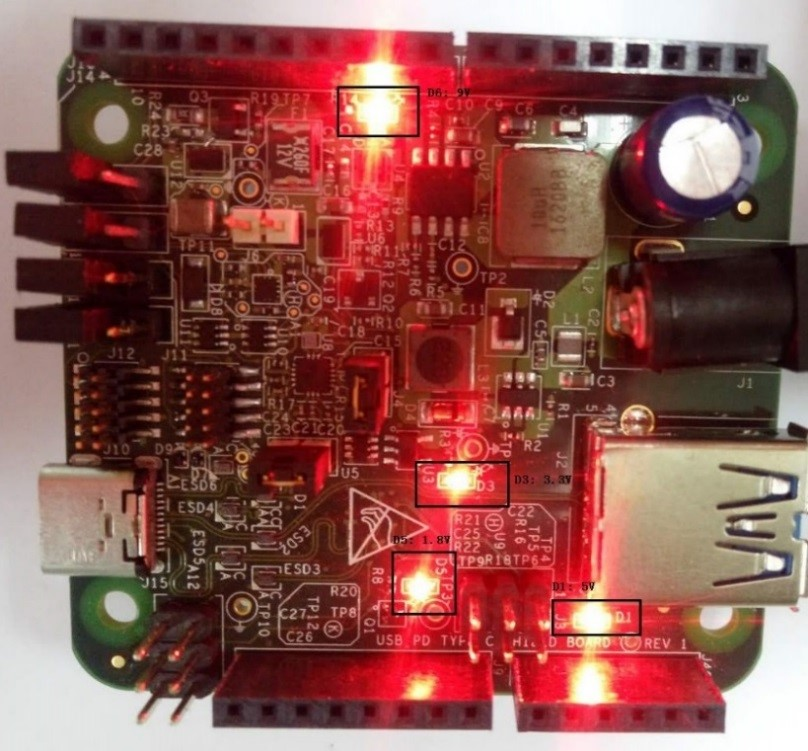

# Setup hardware boards

1.  Connect the debug console port to PC. For example, connect J7 of LPCXpresso54114 to the PC.
2.  Set the shield board’s jumpers and connect the shield board with the development board as shown in section [Hardware re-work](hardware_re-work.md).
3.  Connect a 9 V power source to the J1 jack in the USB-PD/Type C Shield board. The shield LEDs status is as follows:

    |

|

4.  Ensure you run the usb\_pd demo by using the instructions in section [Running the demo](running_the_demo.md).
5.  “pd init success” prints in the debug console.

**Parent topic:**[Demo setup](../topics/demo_setup.md)

