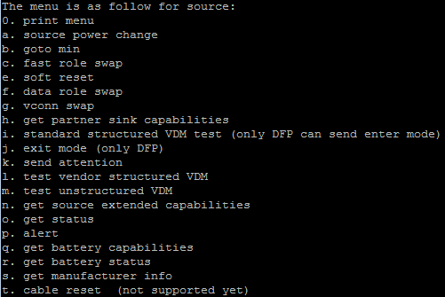

# Test other commands

1.  Input ‘0’ in the debug console. The following menu is printed in the debug console \(the menu is a little different for source and sink\):

    |

|

2.  Input the menu to test the corresponding command.
3.  For example, if you input ‘f’, the “data role swap” command begins, and the debug console prints the result.

**Parent topic:**[Demo setup](../topics/demo_setup.md)

