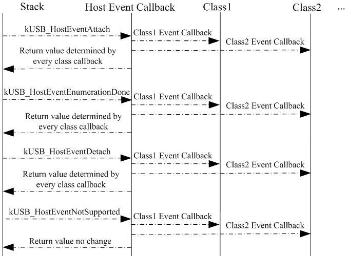

# Introduction

Unlike the composite device that requires many steps, implementing a host that supports multiple devices is simple. The event callback function of host and class can handle attach, enumeration, and detach processing for all the devices. The process flow for this is shown in Figure 1. This figure shows a host supporting two classes, which is the same as a host supporting one class. All class-specific functionality for the devices is achieved in the class-specific task polling in the main function. The user only needs to focus on the modification of these two points.

|

|

