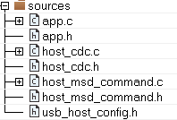
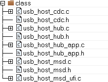

# USB component files

Add the usb\_host\_msd component files, the usb\_host\_msd\_ufi source file, and the host\_msd\_command component files into the current project. Normally, the host\_msd\_command component should be in the source folder, shown in Figure 2. The usb\_host\_msd component and the usb\_host\_msd\_ufi source file should be located in the class folder showing in the Figure 3.

|

|

|

|

**Parent topic:**[Host MSD command + CDC virtual com example](../topics/host_msd_command__cdc_virtual_com_example.md)

