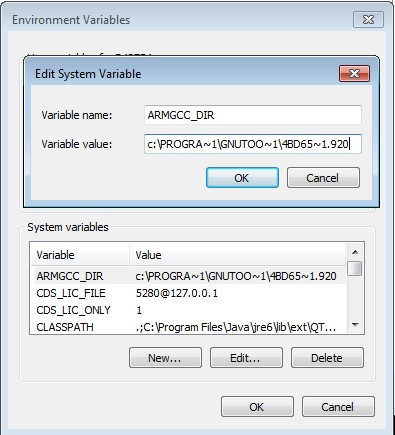

# Add new system environment variable ARMGCC\_DIR

Create a new system environment variable ARMGCC\_DIR. The value of this variable should be the short name of the Arm GCC Embedded tool chain installation path.

|

|

**Parent topic:**[Step-by-step guide for ARMGCC](../topics/step-by-step_guide_for_arm_gcc.md)

