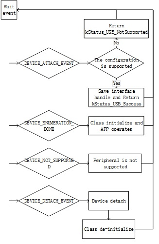

# Background

In the USB system, the host software controls the bus and talks to the target devices following the rules defined by the specification. A device is represented by a configuration that is a collection of one or more interfaces. Each interface comprises one or more endpoints. Each endpoint is represented as a logical pipe from the application software perspective.

The host application software registers a callback with the USB host stack, which notifies the application about the device attach/detach events and determines whether the device is supported or not. The following figure shows the enumeration and detachment flow.

|

|

The USB host stack is a few lines of code executed before starting communication with the USB device. The examples on the USB stack are written with class driver APIs. Class drivers work with the host API as a supplement to the functionality. They make it easy to achieve the target functionality \(see example sources for details\) without dealing with the implementation of standard routines. The following code steps are taken inside a host application driver for any specific device.

**Parent topic:**[Developing a new USB host application](../topics/developing_a_new_usb_host_application.md)

