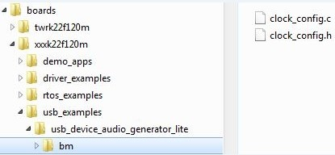
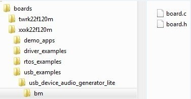

# Board files

The files for the board configuration and the clock configuration on a specific platform are needed to enable the USB stack.

The clock configuration files are shown in the following image.

|

|

1.  Create a folder “xxxk22f120m” under the examples directory.
2.  Copy the clock\_config.c and clock\_config.h file from the similar platform. For example, the TWR-K22F120M Tower System module.
3.  Ensure that `BOARD_BootClockxxx` is implemented in the clock\_config.c file. For example, `BOARD_BootClockRUN` and `BOARD_BootClockHSRUN`. The user can change the function name. However, the `BOARD_InitHardware` must call the function. `BOARD_InitHardware` is introduced later.

    The board clock initialization is based on the board crystal oscillator. Ensure that the following two MACROs are defined in the clock\_config.h file:

    ```
    #define BOARD_XTAL0_CLK_HZ    8000000U
    #define BOARD_XTAL32K_CLK_HZ  32768U
    
    ```

    The user can updatethe MACROs according to the board design. For example, if the XTAL0 crystal oscillator is 16000000U and the XTAL32K is 32768U, change the following MACROs as follows:

    ```
    #define BOARD_XTAL0_CLK_HZ    **16000000U**
    #define BOARD_XTAL32K_CLK_HZ  32768U
    
    ```

    The board configuration files are shown in the following image:

    |

|

4.  Copy board.c and board.h from the similar platform. For example, the TWR-K22F120M platform. Ensure that the `BOARD_InitDebugConsole` is implemented in board.c file and that the `BOARD_InitHardware` calls the function. The `BOARD_InitHardware` function is introduced later.

    The Debug console-related MACROS are needed in the board.h file, as follows:

    ```
    #define BOARD_DEBUG_UART_TYPE DEBUG_CONSOLE_DEVICE_TYPE_UART
    #define BOARD_DEBUG_UART_BASEADDR (uint32_t) UART2
    #define BOARD_DEBUG_UART_CLKSRC BUS_CLK
    #define BOARD_DEBUG_UART_BAUDRATE 115200
    
    ```

    Update the MACROs according to the board design. For example, the default UART instance on the board is LPUART1, the type of default UART instance on one specific platform is LPUART, and the LPUART clock source is the external clock. In this case, change the above MACROs as follows:

    ```
    #define BOARD_DEBUG_UART_TYPE **DEBUG\_CONSOLE\_DEVICE\_TYPE\_LPUART**
    #define BOARD_DEBUG_UART_BASEADDR (uint32_t) **LPUART1**
    #define BOARD_DEBUG_UART_CLKSRC **kCLOCK\_Osc0ErClk**
    #define BOARD_DEBUG_UART_BAUDRATE 115200
    
    ```

    Note that there are three kinds of UART instances provided in MCUXpresso SDK devices, UART, LPUART, and LPSCI. The interfaces of the UART instance are different. To provide a uniform UART interface to a USB Host example in which the UART function is used, a UART instance wrapper is provided. The wrapper is implemented in the usb\_uart\_drv.c, usb\_lpuart\_drv.c, or usb\_lpsci\_drv.c file and has a common header file usb\_uart\_drv.h. For a different UART instance, use the corresponding UART instance wrapper file in the project.


**Parent topic:**[Porting to a new platform](../topics/porting_to_a_new_platform.md)

