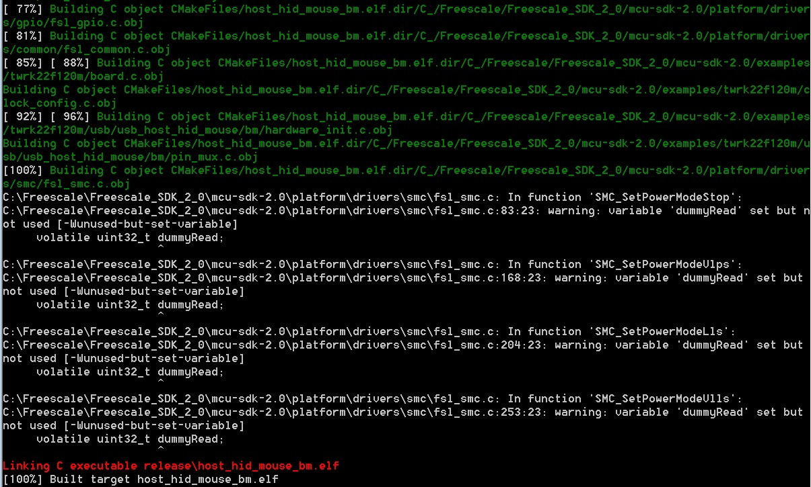

# Build the USB demo

1.  Change the directory to the project directory:*<install\_dir\>/boards/twrk22f120m/usb\_examples/usb\_host\_hid\_mouse/bm/armgcc.*
2.  Run the build\_all.bat. The build output is shown in this figure:

    |

|

**Parent topic:**[Step-by-step guide for ARMGCC](../topics/step-by-step_guide_for_arm_gcc.md)

