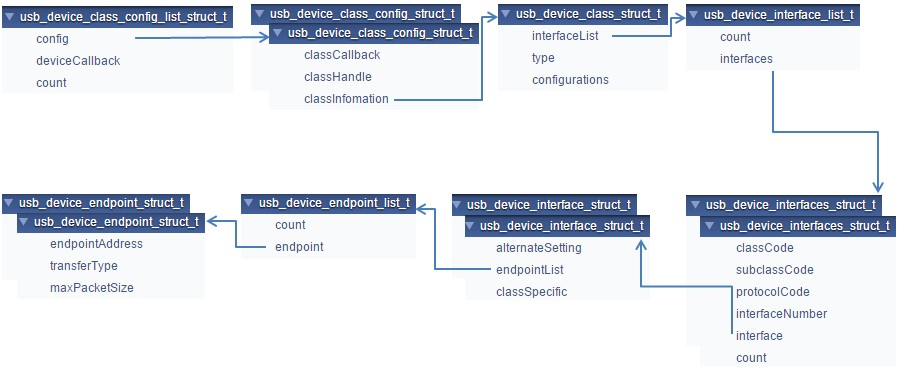

# Changing the usb\_device\_descriptor.c file

This file contains the class driver interface. It also contains USB standard descriptors such as device descriptor, configuration descriptor, string descriptor, and the other class-specific descriptors that are provided to class driver when required.

The lists below show user-modifiable variable types for an already implemented class driver. The user should also modify the corresponding MACROs defined in the usb\_device\_descriptor.h file. See the *MCUXpresso SDK API Reference Manual* \(document MCUXSDKAPIRM\) for details.

-   usb\_device\_endpoint\_struct\_t;
-   usb\_device\_endpoint\_list\_t;
-   usb\_device\_interface\_struct\_t;
-   usb\_device\_interfaces\_struct\_t;
-   usb\_device\_interface\_list\_t;
-   usb\_device\_class\_struct\_t;
-   usb\_device\_class\_config\_struct\_t;
-   usb\_device\_class\_config\_list\_struct\_t;

This diagram shows the relationship between these items:

|

|

This is the sample code implementation of the endpoint descriptor for the HID class:

```
/* HID mouse endpoint information */
usb_device_endpoint_struct_t g_UsbDeviceHidMouseEndpoints[USB_HID_MOUSE_ENDPOINT_COUNT] =
{
    /* HID mouse interrupt IN pipe */
    {
        USB_HID_MOUSE_ENDPOINT_IN | (USB_IN << USB_DESCRIPTOR_ENDPOINT_ADDRESS_DIRECTION_SHIFT),
        USB_ENDPOINT_INTERRUPT,
        FS_HID_MOUSE_INTERRUPT_IN_PACKET_SIZE,
    },
};
```

The endpoint address, transfer type, and max packet size in this variable are defined in the usb\_device\_descriptor.h file. The user may change these value as required. For example, to implement a CDC class application:

```
/* Define endpoint for a communication class */
usb_device_endpoint_struct_t g_UsbDeviceCdcVcomCicEndpoints[USB_CDC_VCOM_ENDPOINT_CIC_COUNT] = {
    {
        USB_CDC_VCOM_INTERRUPT_IN_ENDPOINT | (USB_IN << 7U), USB_ENDPOINT_INTERRUPT,
        FS_CDC_VCOM_INTERRUPT_IN_PACKET_SIZE,
    },
};
/* Define endpoint for data class */
usb_device_endpoint_struct_t g_UsbDeviceCdcVcomDicEndpoints[USB_CDC_VCOM_ENDPOINT_DIC_COUNT] = {
    {
        USB_CDC_VCOM_BULK_IN_ENDPOINT | (USB_IN << 7U), USB_ENDPOINT_BULK, FS_CDC_VCOM_BULK_IN_PACKET_SIZE,
    },
    {
        USB_CDC_VCOM_BULK_OUT_ENDPOINT | (USB_OUT << 7U), USB_ENDPOINT_BULK, FS_CDC_VCOM_BULK_OUT_PACKET_SIZE,
    }
};
```

The endpoint count and alternate setting of the interface may differ in various applications. The user may change these values as required. For example, the interface structure of a CDC class application is as follows:

```
/* Define interface for communication class */
usb_device_interface_struct_t g_UsbDeviceCdcVcomCommunicationInterface[] = {{
    1U,
    {
        USB_CDC_VCOM_ENDPOINT_CIC_COUNT, g_UsbDeviceCdcVcomCicEndpoints,
    },
}};
/* Define interface for data class */
usb_device_interface_struct_t g_UsbDeviceCdcVcomDataInterface[] =
{
    {
        0,
        {
            USB_CDC_VCOM_ENDPOINT_DIC_COUNT,
            g_UsbDeviceCdcVcomDicEndpoints,
        },
        NULL
    }
};
```

The class code, subclass code, and protocol code may differ in various classes. For example, the usb\_device\_interfaces\_struct of a CDC class is as follows:

```
/* Define interfaces for the virtual com */
usb_device_interfaces_struct_t g_UsbDeviceCdcVcomInterfaces[USB_CDC_VCOM_INTERFACE_COUNT] = {
    {USB_CDC_VCOM_CIC_CLASS, USB_CDC_VCOM_CIC_SUBCLASS, USB_CDC_VCOM_CIC_PROTOCOL, USB_CDC_VCOM_COMM_INTERFACE_INDEX,
     g_UsbDeviceCdcVcomCommunicationInterface,
     sizeof(g_UsbDeviceCdcVcomCommunicationInterface) / sizeof(usb_device_interfaces_struct_t)},
    {USB_CDC_VCOM_DIC_CLASS, USB_CDC_VCOM_DIC_SUBCLASS, USB_CDC_VCOM_DIC_PROTOCOL, USB_CDC_VCOM_DATA_INTERFACE_INDEX,
     g_UsbDeviceCdcVcomDataInterface, sizeof(g_UsbDeviceCdcVcomDataInterface) / sizeof(usb_device_interfaces_struct_t)},
};
```

The interface count may differ in various applications. For example, the usb\_device\_interface\_list of a CDC class application is as follows:

```
/* Define configurations for virtual com */
usb_device_interface_list_t g_UsbDeviceCdcVcomInterfaceList[USB_DEVICE_CONFIGURATION_COUNT] = {
    {
        USB_CDC_VCOM_INTERFACE_COUNT, g_UsbDeviceCdcVcomInterfaces,
    },
};
```

The interface list, class type and configuration count may differ in various applications. For example, the usb\_device\_class\_struct of a CDC class application is as follows:

```
/* Define class information for virtual com */
usb_device_class_struct_t g_UsbDeviceCdcVcomConfig = {
    g_UsbDeviceCdcVcomInterfaceList, kUSB_DeviceClassTypeCdc, USB_DEVICE_CONFIGURATION_COUNT,
};
```

-   g\_UsbDeviceDescriptor

    This variable contains the USB Device Descriptor.

    Sample code implementation of the device descriptor for the HID class is shown as follows:

    ```
    uint8_t g_UsbDeviceDescriptor[USB_DESCRIPTOR_LENGTH_DEVICE] =
    {
        USB_DESCRIPTOR_LENGTH_DEVICE,    /* Size of this descriptor in bytes */
        USB_DESCRIPTOR_TYPE_DEVICE,      /* DEVICE Descriptor Type */
        USB_SHORT_GET_LOW(USB_DEVICE_SPECIFIC_BCD_VERSION),
        USB_SHORT_GET_HIGH(USB_DEVICE_SPECIFIC_BCD_VERSION),/* USB Specification Release Number in
                                                               Binary-Coded Decimal (i.e., 2.10 is 210H). */
        USB_DEVICE_CLASS,                /* Class code (assigned by the USB-IF). */
        USB_DEVICE_SUBCLASS,             /* Subclass code (assigned by the USB-IF). */
        USB_DEVICE_PROTOCOL,             /* Protocol code (assigned by the USB-IF). */
        USB_CONTROL_MAX_PACKET_SIZE,     /* Maximum packet size for endpoint zero
                                            (only 8, 16, 32, or 64 are valid) */
        0xA2U, 0x15U,                    /* Vendor ID (assigned by the USB-IF) */
        0x7CU, 0x00U,                    /* Product ID (assigned by the manufacturer) */
        USB_SHORT_GET_LOW(USB_DEVICE_DEMO_BCD_VERSION),
        USB_SHORT_GET_HIGH(USB_DEVICE_DEMO_BCD_VERSION),/* Device release number in binary-coded decimal */
        0x01U,                           /* Index of string descriptor describing manufacturer */
        0x02U,                           /* Index of string descriptor describing product */
        0x00U,                           /* Index of string descriptor describing the
                                            device serial number */
        USB_DEVICE_CONFIGURATION_COUNT,  /* Number of possible configurations */
    };
    ```


The macros in the variable above are defined in the usb\_device\_descriptor.h file, such as the USB\_DEVICE\_CLASS, USB\_DEVICE\_SUBCLASS, and USB\_DEVICE\_PROTOCOL. Those values may need to be modified as required. The vendor ID and product ID can also be modified.

-   g\_UsbDeviceConfigurationDescriptor

    This variable contains the USB Configuration Descriptor.

    Sample code implementation of the configuration descriptor for the HID class is providing in the following:

    ```
    uint8_t g_UsbDeviceConfigurationDescriptor[USB_DESCRIPTOR_LENGTH_CONFIGURATION_ALL] =
    {
       USB_DESCRIPTOR_LENGTH_CONFIGURE,  /* Size of this descriptor in bytes */
       USB_DESCRIPTOR_TYPE_CONFIGURE,    /* CONFIGURATION Descriptor Type */
       USB_SHORT_GET_LOW(USB_DESCRIPTOR_LENGTH_CONFIGURATION_ALL),
       USB_SHORT_GET_HIGH(USB_DESCRIPTOR_LENGTH_CONFIGURATION_ALL),/* Total length of data returned for this configuration. */
       USB_HID_MOUSE_INTERFACE_COUNT,  /* Number of interfaces supported by this configuration */
       USB_HID_MOUSE_CONFIGURE_INDEX,  /* Value to use as an argument to the
                                            SetConfiguration() request to select this configuration */
       0x00U,                            /* Index of string descriptor describing this configuration */
       (USB_DESCRIPTOR_CONFIGURE_ATTRIBUTE_D7_MASK) |
       (USB_DEVICE_CONFIG_SELF_POWER << USB_DESCRIPTOR_CONFIGURE_ATTRIBUTE_SELF_POWERED_SHIFT) |
       (USB_DEVICE_CONFIG_REMOTE_WAKEUP << USB_DESCRIPTOR_CONFIGURE_ATTRIBUTE_REMOTE_WAKEUP_SHIFT),
                                         /* Configuration characteristics
                                              D7: Reserved (set to one)
                                              D6: Self-powered
                                              D5: Remote Wakeup
                                              D4...0: Reserved (reset to zero)
                                         */
       USB_DEVICE_MAX_POWER,             /* Maximum power consumption of the USB
                                          * device from the bus in this specific
                                          * configuration when the device is fully
                                          * operational. Expressed in 2 mA units
                                          *  (i.e., 50 = 100 mA).
                                          */
    ```


The macro USB\_DESCRIPTOR\_LENGTH\_CONFIGURATION\_ALL, which is defined in the usb\_device\_descriptor.h, needs to be modified to equal the size of this variable. The interface count and configuration index may differ in various applications. For example, this part of a CDC class application is as shown below:

```
/* Size of this descriptor in bytes */
USB_DESCRIPTOR_LENGTH_CONFIGURE,
/* CONFIGURATION Descriptor Type */
USB_DESCRIPTOR_TYPE_CONFIGURE,
/* Total length of data returned for this configuration. */
USB_SHORT_GET_LOW(USB_DESCRIPTOR_LENGTH_CONFIGURATION_ALL),
USB_SHORT_GET_HIGH(USB_DESCRIPTOR_LENGTH_CONFIGURATION_ALL),
/* Number of interfaces supported by this configuration */
USB_CDC_VCOM_INTERFACE_COUNT,
/* Value to use as an argument to the SetConfiguration() request to select this configuration */
USB_CDC_VCOM_CONFIGURE_INDEX,
/* Index of string descriptor describing this configuration */
0,
/* Configuration characteristics D7: Reserved (set to one) D6: Self-powered D5: Remote Wakeup D4...0: Reserved
   (reset to zero) */
(USB_DESCRIPTOR_CONFIGURE_ATTRIBUTE_D7_MASK) |
    (USB_DEVICE_CONFIG_SELF_POWER << USB_DESCRIPTOR_CONFIGURE_ATTRIBUTE_SELF_POWERED_SHIFT) |
    (USB_DEVICE_CONFIG_REMOTE_WAKEUP << USB_DESCRIPTOR_CONFIGURE_ATTRIBUTE_REMOTE_WAKEUP_SHIFT),
/* Maximum power consumption of the USB * device from the bus in this specific * configuration when the device is
   fully * operational. Expressed in 2 mA units *  (i.e., 50 = 100 mA).  */
USB_DEVICE_MAX_POWER,
```

The interface descriptor may differ from various applications. For example, the interface descriptor of a CDC class application would be as shown below.

```
/* Communication Interface Descriptor */
USB_DESCRIPTOR_LENGTH_INTERFACE, USB_DESCRIPTOR_TYPE_INTERFACE, USB_CDC_VCOM_COMM_INTERFACE_INDEX, 0x00,
USB_CDC_VCOM_ENDPOINT_CIC_COUNT, USB_CDC_VCOM_CIC_CLASS, USB_CDC_VCOM_CIC_SUBCLASS, USB_CDC_VCOM_CIC_PROTOCOL,
0x00, /* Interface Description String Index*/
```

The class specific descriptor may differ from various applications. For example, the class specific descriptor of a CDC class application would be as shown below.

```
/* CDC Class-Specific descriptor */
USB_DESCRIPTOR_LENGTH_CDC_HEADER_FUNC, /* Size of this descriptor in bytes */
USB_DESCRIPTOR_TYPE_CDC_CS_INTERFACE,  /* CS_INTERFACE Descriptor Type */
HEADER_FUNC_DESC, 0x10,
0x01, /* USB Class Definitions for Communications the Communication specification version 1.10 */
USB_DESCRIPTOR_LENGTH_CDC_CALL_MANAG, /* Size of this descriptor in bytes */
USB_DESCRIPTOR_TYPE_CDC_CS_INTERFACE, /* CS_INTERFACE Descriptor Type */
CALL_MANAGEMENT_FUNC_DESC,
0x01, /*Bit 0: Whether device handle call management itself 1, Bit 1: Whether device can send/receive call
         management information over a Data Class Interface 0 */
0x01, /* Indicates multiplexed commands are handled via data interface */
   USB_DESCRIPTOR_LENGTH_CDC_ABSTRACT,   /* Size of this descriptor in bytes */
USB_DESCRIPTOR_TYPE_CDC_CS_INTERFACE, /* CS_INTERFACE Descriptor Type */
USB_CDC_ABSTRACT_CONTROL_FUNC_DESC,
0x06, /* Bit 0: Whether device supports the request combination of Set_Comm_Feature, Clear_Comm_Feature, and
         Get_Comm_Feature 0, Bit 1: Whether device supports the request combination of Set_Line_Coding,
         Set_Control_Line_State, Get_Line_Coding, and the notification Serial_State 1, Bit ...  */
USB_DESCRIPTOR_LENGTH_CDC_UNION_FUNC, /* Size of this descriptor in bytes */
USB_DESCRIPTOR_TYPE_CDC_CS_INTERFACE, /* CS_INTERFACE Descriptor Type */
USB_CDC_UNION_FUNC_DESC, 0x00,        /* The interface number of the Communications or Data Class interface  */
0x01,                                 /* Interface number of subordinate interface in the Union  */
```

The endpoint descriptor may differ from various applications. For example, the endpoint descriptor of a CDC class application is as follows:

```
/*Notification Endpoint descriptor */
    USB_DESCRIPTOR_LENGTH_ENDPOINT, USB_DESCRIPTOR_TYPE_ENDPOINT, USB_CDC_VCOM_INTERRUPT_IN_ENDPOINT | (USB_IN << 7U),
    USB_ENDPOINT_INTERRUPT, USB_SHORT_GET_LOW(FS_CDC_VCOM_INTERRUPT_IN_PACKET_SIZE),
    USB_SHORT_GET_HIGH(FS_CDC_VCOM_INTERRUPT_IN_PACKET_SIZE), FS_CDC_VCOM_INTERRUPT_IN_INTERVAL,
}
```

-   String Descriptors

    Users can modify string descriptors to customize their product. String descriptors are written in the UNICODE format. An appropriate language identification number is specified in the USB\_STR\_0. Multiple language support can also be added.


-   USB\_DeviceGetDeviceDescriptor

    This interface function is invoked by the application. This call is made when the application receives the kUSB\_DeviceEventGetDeviceDescriptor event from the Host. Mandatory descriptors that an application is required to implement are as follows:

    -   Device Descriptor
    -   Configuration Descriptor
    -   Class-Specific Descriptors \(For example, for HID class implementation, Report Descriptor, and HID Descriptor\)
    Apart from the mandatory descriptors, an application should also implement various string descriptors as specified by the Device Descriptor and other configuration descriptors.

    Sample code for HID class application is as follows:

    ```
    /* Get device descriptor request */
    usb_status_t USB_DeviceGetDeviceDescriptor(usb_device_handle handle,
                                                usb_device_get_device_descriptor_struct_t *deviceDescriptor)
    {
        deviceDescriptor->buffer = g_UsbDeviceDescriptor;
        deviceDescriptor->length = USB_DESCRIPTOR_LENGTH_DEVICE;
        return kStatus_USB_Success;
    }
    ```


The user may assign the appropriate variable of the device descriptor. For example, if the device descriptor variable name is g\_UsbDeviceDescriptorUser, the sample code is as follows:

```
/* Get device descriptor request */
usb_status_t USB_DeviceGetDeviceDescriptor(usb_device_handle handle,
                                            usb_device_get_device_descriptor_struct_t *deviceDescriptor)
{
    deviceDescriptor->buffer = g_UsbDeviceDescriptorUser;
    deviceDescriptor->length = USB_DESCRIPTOR_LENGTH_DEVICE;
    return kStatus_USB_Success;
}
```

-   USB\_DeviceGetConfigurationDescriptor

    This interface function is invoked by the application. This call is made when the application receives the kUSB\_DeviceEventGetConfigurationDescriptor event from the Host.

    ```
    /* Get device configuration descriptor request */
    usb_status_t USB_DeviceGetConfigurationDescriptor(
        usb_device_handle handle, usb_device_get_configuration_descriptor_struct_t *configurationDescriptor)
    {
        if (USB_HID_MOUSE_CONFIGURE_INDEX > configurationDescriptor->configuration)
        {
            configurationDescriptor->buffer = g_UsbDeviceConfigurationDescriptor;
            configurationDescriptor->length = USB_DESCRIPTOR_LENGTH_CONFIGURATION_ALL;
            return kStatus_USB_Success;
        }
        return kStatus_USB_InvalidRequest;
    }
    ```


The macro HID\_MOUSE\_CONFIGURE\_INDEX may differ from various applications. For example, the implementation of a CDC class application would be as follows:

```
usb_status_t USB_DeviceGetConfigurationDescriptor(
    usb_device_handle handle, usb_device_get_configuration_descriptor_struct_t *configurationDescriptor)
{
    if (USB_CDC_VCOM_CONFIGURE_INDEX > configurationDescriptor->configuration)
    {
        configurationDescriptor->buffer = g_UsbDeviceConfigurationDescriptor;
        configurationDescriptor->length = USB_DESCRIPTOR_LENGTH_CONFIGURATION_ALL;
        return kStatus_USB_Success;
    }
    return kStatus_USB_InvalidRequest;
}
```

-   USB\_DeviceGetStringDescriptor

    This interface function is invoked by the application. This call is made when the application receives the kUSB\_DeviceEventGetStringDescriptor event from the Host.

    See the usb\_device\_hid\_mouse example for sample code.


-   USB\_DeviceGetHidReportDescriptor

    This interface function is invoked by the application. This call is made when the application receives the kUSB\_DeviceEventGetHidReportDescriptor event from the Host.

    See the usb\_device\_hid\_mouse example for sample code.


-   USB\_DeviceSetSpeed

    Because HS and FS descriptors are different, the device descriptors and configurations need to be updated to match the current speed. By default, the device descriptors and configurations are configured using FS parameters for EHCI, KHCI, and other controllers, such as LPC IP3511. When the EHCI is enabled, the application needs to call this function to update the device by using the current speed. The updated information includes the endpoint max packet size, endpoint interval, and so on.


**Parent topic:**[How to develop a new device application](../topics/how_to_develop_a_new_device_application.md)

