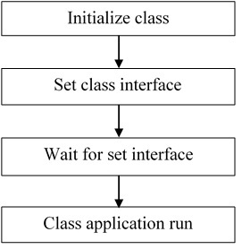

# Class initialization

When the supported device is attached, the device’s class needs to be initialized.

For example, the HID mouse initialization flow is as follows:

|

|

-   Call class initialization function to initialize the class instance.
-   Call class set interface function to set the class interface
-   When the set interface callback returns successfully, the application can run.

**Parent topic:**[How to develop a new host application](../topics/how_to_develop_a_new_host_application.md)

