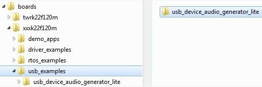

# Copy a new platform example

The platform USB examples directory is shown in the following figure.

|

|

Copy the existed example’s whole directory from the similar platform, which ensures that all example source files and project files are copied.

For example, copy the *twrk22f120m/usb/usb\_device\_audio\_generator\_lite* to the *twrkxx/usb* location, which ensures that sources files and project files for usb\_device\_audio\_generator\_lite example are copied.

**Parent topic:**[Porting examples](../topics/porting_examples.md)

