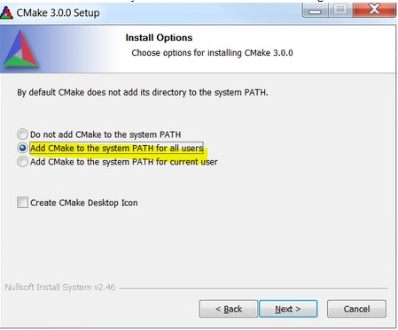

# Install CMake

1.  Download CMake 3.0.1 from [www.cmake.org/cmake/resources/software.html](http://www.cmake.org/cmake/resources/software.html).
2.  Install CMake 3.0.1 and ensure that the option "Add CMake to system PATH" is selected.

    |

|

**Parent topic:**[Step-by-step guide for ARMGCC](../topics/step-by-step_guide_for_arm_gcc.md)

