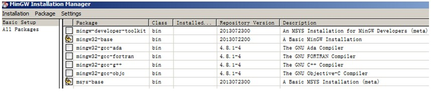
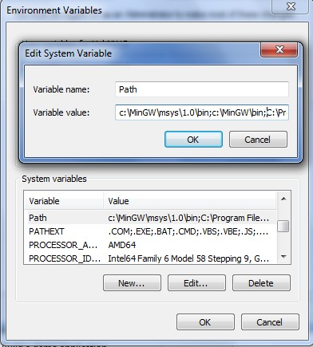

# Install MinGW

1.  Download the latest mingw-get-setup.exe.
2.  Install the GCC Arm Embedded toolchain. The recommended path is C:/MINGW.

    **Note:** The installation path should not contain a space.

3.  Ensure that the mingw32-base and msys-base are selected under basic setup.
4.  Click “Installation” and “Apply changes”.

    |

|

5.  Add paths C:/MINGW/msys/1.0/bin;C:/MINGW/bin to the system environment. If the GCC Arm Embedded tool chain was not installed at the recommended location, the system paths added should reflect this change else the tool chain will not work. An example using the recommended installation locations is shown below.

    |

|

**Parent topic:**[Step-by-step guide for ARMGCC](../topics/step-by-step_guide_for_arm_gcc.md)

