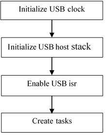

# Main application function flow

In the main application function, follow these steps:

|

|

-   Initialize the USB clock.

    Call the MCUXpresso SDK API to initialize the KHCI, the EHCI USB clock, or other controller.

-   Initialize the host controller.

    This allows the stack to initialize the necessary memory required to run the stack and register the callback function to the stack.

    For example:`status = USB_HostInit(CONTROLLER_ID, &g_HostHandle, USB_HostEvent);`

-   Enable the USB ISR.

    Set the USB interrupt priority and enable the USB interrupt.

-   Initialize the host stack task and application task.

    For example \(Bare metal\):

    ```
    while (1)
    {
    USB_HostTaskFn(g_HostHandle);
    USB_HostMsdTask(&g_MsdCommandInstance);
    ```

    Note that in this code, the g\_MsdCommandInstance variable contains all states and pointers used by the application to control or operate the device. If implementing the application task as USB\_HostHidTestTask and use g\_HidTestInstance to maintain the application states, modify the code as follows:

    ```
    while (1)
    {
    USB_HostTaskFn(g_HostHandle);
        USB_HostHidTestTask(&g_HidTestInstance);
    }
    ```


**Parent topic:**[How to develop a new host application](../topics/how_to_develop_a_new_host_application.md)

