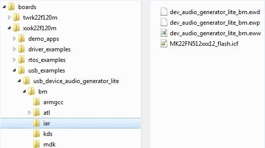
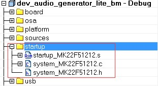
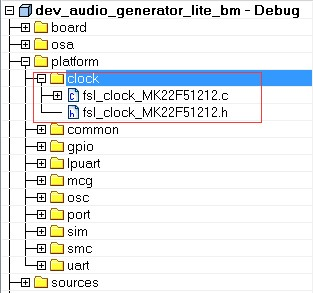
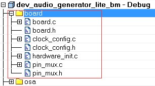
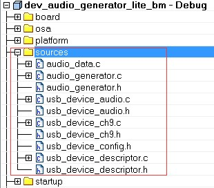
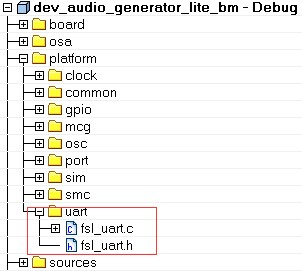

# Modify the example project

USB example project files are kept in the example directory, as shown in the following figure.

|

|

1.  Open the project and change the SoC.

    **Note:**

    1.  Check the project SoC and update to the porting platform SoC.
    2.  Update the SoC full name, platform name, and board type name macros if the SoC is updated. For example, for TWR-K22F120M, update the CPU\_MK22FN512VDC12, TWR\_K22F120M, and TOWER macros.
2.  Check the files in startup group, for example \(IAR\):

    |

|

    Ensure that the system\_MK22F51212.c, system\_MK22F51212.h, and strtup\_MK22F51212.s are the porting SoC files. Also change the include path.

3.  Check the files in the platform/clock group, for example \(IAR\):

    |

|

    Ensure that the fsl\_clock\_MK22F51212.c, and fsl\_clock\_MK22F51212.h are porting SoC files. Additionally, change the include path.

4.  Change the files in board group, for example \(IAR\):

    |

|

    Ensure that board.c, board.h, clock\_config.c, and clock\_config.h are porting platform files. Additionally, change the include path.

5.  Check the files in the sources group, for example \(IAR\):

    |

|

    The example application source files are copied when copying the example directory. Change the include path.

6.  Change the linker file to the new platform. Ensure that the linker file is the porting SoC file.
7.  Debug console may use UART, LPUART, or LPSCI according to the platform. As a result, the example project needs to contain UART, LPUART, or LPSCI driver files according to the platform.

    |

|

    For example, for TWR-K22F120M all UART files are all in the project. In another example, TWR-K80F150M, all LPUART files are in the project.

**Parent topic:**[Porting examples](../topics/porting_examples.md)

