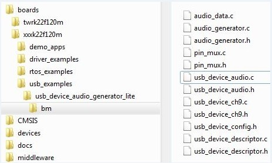

# Porting the example

For different examples, different pins are used. As a result, the pin\_mux.c/h files are needed to assign different pins to a specific functionality. Check the board schematic for correct pin settings.

Example-related port pin configurations are required in the following files:

|

|

Ensure the `BOARD_InitPins` function is implemented in the pin\_mux.c file. In this function, the port clock and pin mux are initialized. Ensure that the `BOARD_InitHardware` calls the function. The `BOARD_InitHardware` function will be introduced later.

For example, on the TWR-K65F180M board, the VBUS of the USB Host is controlled by the PORTD\_8 as a GPIO. Therefore, the PORTD clock needs to be enabled first and then the PORTD\_8 configured to GPIO functionality. The debug console uses UART2. The TX/RX pins are PORTE\_16 and PORTE\_17. As a result, the clock of PORTE needs to be enabled first and then the PORTE\_16 and PORTE\_17 configured to alternative 3.

This is example code for TWR-K65F180M:

```
void BOARD_InitPins(void)
{
/* Initialize UART2 pins below */
CLOCK_EnableClock(kCLOCK_PortE);
    PORT_SetPinMux(PORTE, 16u, kPORT_MuxAlt3);
    PORT_SetPinMux(PORTE, 17u, kPORT_MuxAlt3);
    /* Initialize usb vbus pin */
    CLOCK_EnableClock(kCLOCK_PortD);
    PORT_SetPinMux(PORTD, 8u, kPORT_MuxAsGpio);
}

```

Check the specific board design to find out which port is used to control the USB VBUS and which port is used for the debug console. For example, in the customer’s board design, the PORTC\_15 is used to control the USB VBUS, and PORTD\_1 and PORTD\_2 is used for debug console. The following shows the example code:

```
void BOARD_InitPins(void)
{
/* Initialize UART2 pins below */
CLOCK_EnableClock(**kCLOCK\_PortD**);
    PORT_SetPinMux(**PORTD, 1u,** kPORT_MuxAlt3);
    PORT_SetPinMux(**PORTD, 2u,** kPORT_MuxAlt3);
    /* Initialize usb vbus pin */
    CLOCK_EnableClock(**kCLOCK\_PortC**);
    PORT_SetPinMux(**PORTC, 15u,** kPORT_MuxAsGpio);
}

```

The VBUS must output high. The following is example code for TWR-K65F180M:

```
void BOARD_InitHardware(void)
{
gpio_pin_config_t pinConfig;
BOARD_InitPins();
BOARD_BootClockRUN();
BOARD_InitDebugConsole();
/* vbus gpio output high */
pinConfig.pinDirection = kGPIO_DigitalOutput;
pinConfig.outputLogic = 1U;
GPIO_PinInit(PTD, 8U, &pinConfig);
}

```

The user can change the function as follows:

```
void BOARD_InitHardware(void)
{
gpio_pin_config_t pinConfig;
BOARD_InitPins();
**BOARD\_BootClockxxx**();
BOARD_InitDebugConsole();
/* vbus gpio output high */
pinConfig.pinDirection = kGPIO_DigitalOutput;
pinConfig.outputLogic = 1U;
GPIO_PinInit(PTC, 15U, &pinConfig);
}

```

**Parent topic:**[Porting examples](../topics/porting_examples.md)

