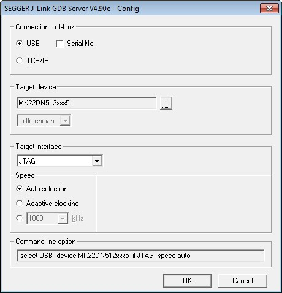

# Run a demo application

This section describes steps to run a demo application using J-Link GDB Server application.

1.  Connect the J-Link debug port to the SWD/JTAG connector of the board.
2.  Open the J-Link GDB Server application and modify your connection settings as shown in this figure.

    |

|

    **Note:** The target device selection should be MK22FN512xxx12. The target interface should be SWD.

3.  After the connection is estabilished, the screen would resemble the figure below:

    |

|

    **Note:** The CPU selection should be CPU to: MK22FN512xxx12.

4.  Open the Arm GCC command prompt and change the directory to the output directory of the desired demo. For this example, the directory is:

    *<install\_dir\>/boards/twrk22f120m/usb\_examples/usb\_host\_hid\_mouse/bm/armgcc/debug.*

5.  Run the command “arm-none-eabi-gdb.exe <DEMO\_NAME\>.elf”. Run these commands:
    -   “target remote localhost: 2331”
    -   “monitor reset”
    -   “monitor halt”
    -   “load”
    -   “monitor reset”
6.  The application is downloaded and connected. Execute the “monitor go” command to start the demo application.
7.  See the example-specific document for more test information.

**Parent topic:**[Step-by-step guide for ARMGCC](../topics/step-by-step_guide_for_arm_gcc.md)

