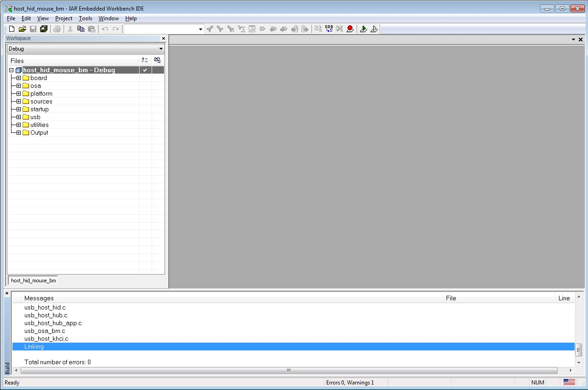

# Step-by-step guide for IAR

This section shows how to use IAR. Open IAR as shown in this figure:

1.  Open the worksace corresponding to different examples.

    For example, the workspace file is located at: *<install\_dir\>/boards/twrk22f120m/usb\_examples/usb\_host\_hid\_mouse/bm/iar/host\_hid\_mouse\_bm.eww*.

    |

|

2.  Build the host\_hid\_mouse\_bm example.
3.  Connect the micro USB cable from a PC to the J25 of the TWR-K22F120M Tower System module to power on the board.
4.  Click the “Download and Debug” button. Wait for the download to complete.
5.  Click the “Go” button to run the example.
6.  See the example-specific readme.pdf for more test information.

**Parent topic:**[Compiling or running the USB stack and examples](../topics/compiling_or_running_the_usb_stack_and_examples.md)

