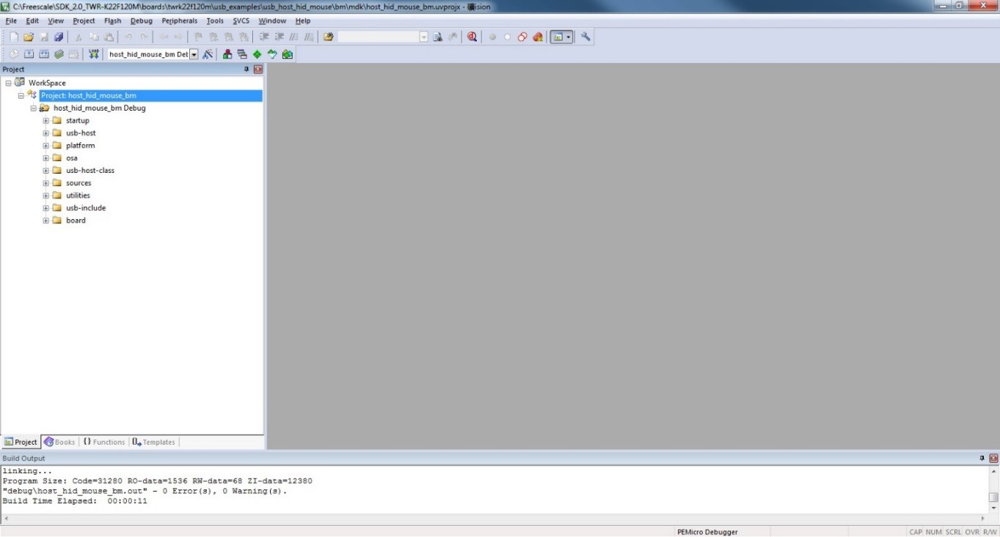

# Step-by-step guide for Keil µVision5

This section shows how to use Keil µVision5. Open Keil µVision5 as shown in this figure:

1.  Open the workspace corresponding to different examples.

    For example, the workspace file is located in *<install\_dir\>/boards/twrk22f120m/usb\_examples/usb\_host\_hid\_mouse/bm/mdk/host\_hid\_mouse\_bm.uvmpw.*

    |

|

2.  Build the host\_hid\_mouse\_bm example.
3.  Click the “Start/Stop” debug session button. Wait for the download to complete.
4.  Click the “Go” button to run the example.
5.  See the example-specific readme.pdf for more test information.

**Parent topic:**[Compiling or running the USB stack and examples](../topics/compiling_or_running_the_usb_stack_and_examples.md)

