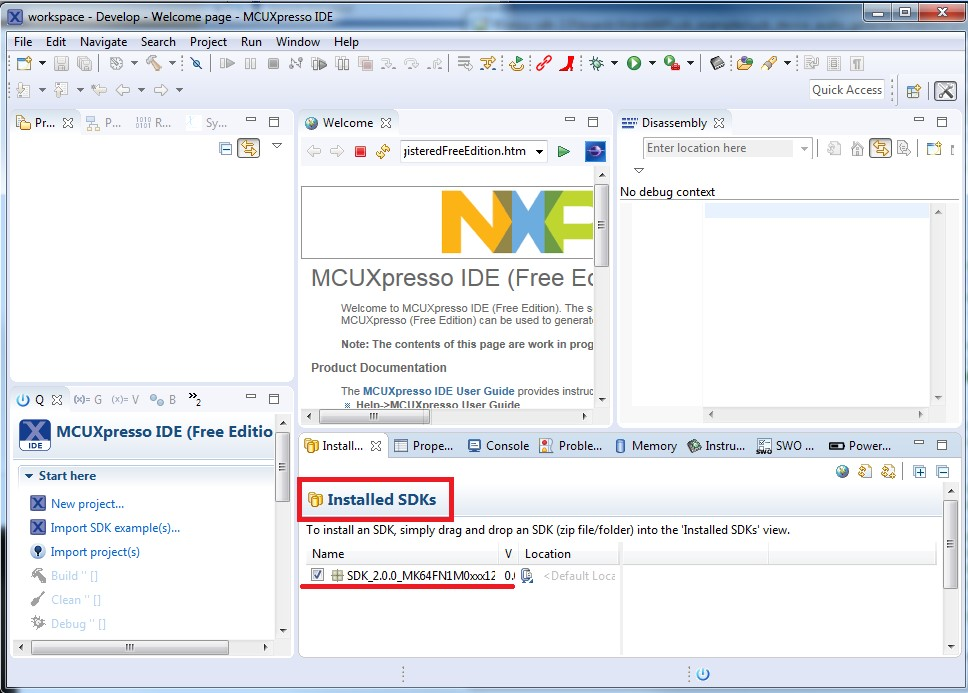
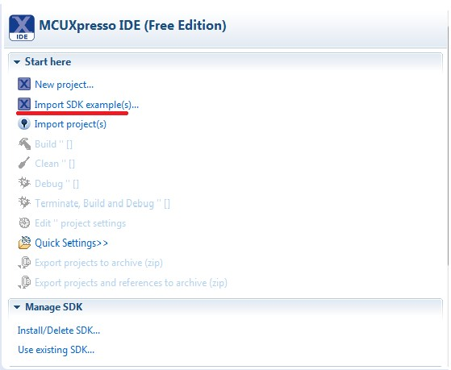
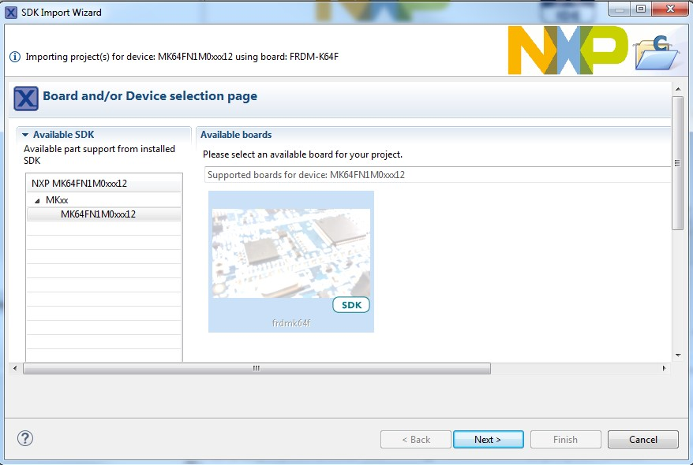
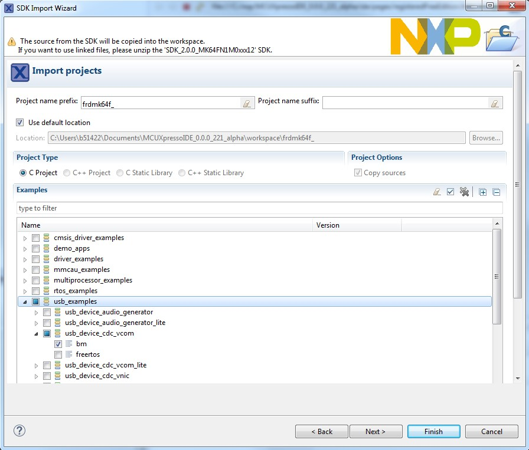
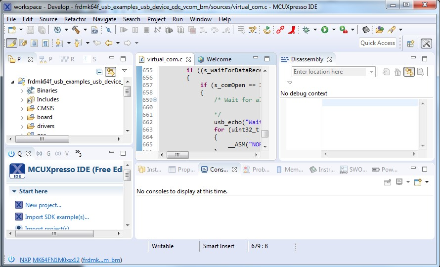
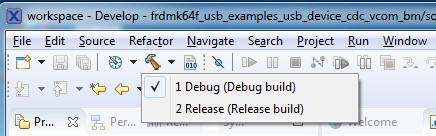
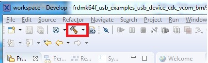
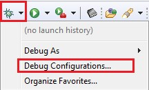
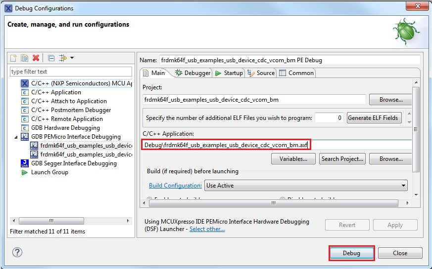
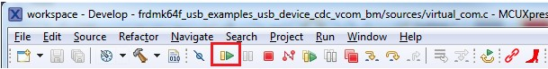

# Step-by-step guide for MCUXpresso IDE

1.  Prepare a compressed release package, such as SDK\_2.0\_FRDM-K64F.zip.
2.  Open MCUXpresso IDE and drag and drop the MCUXpresso SDK \(zip file/folder\) into the "Installed SDKs". The MCUXpresso SDK should install.

    |

|

3.  To select an example, select the “Import SDK example\(s\)” button. Click the “Next” button after selecting the available board.

    |

|

    |

|

4.  To import one example, click the “Finish” button after selecting the available example.

    |

|

5.  After importing, the window should look like the below figure.

    |

|

6.  Choose the appropriate build target, “Debug” or “Release”, by left-clicking the build configuration icon as show in the below figure.

    |

|

7.  If the project build does not begin after selecting the desired target, left-click the build icon to start the build.

    |

|

8.  To check debugger configurations, click the down arrow next to the green debug button and select “Debug Configurations”.

    |

|

9.  After verifying the debugger configurations are correct, click the “Debug” button.

    |

|

10. The application is downloaded to the target and automatically runs to main\(\):
11. Run the code by clicking the “Resume” button to start the application:

    |

|

12. See the example-specific document for more test information.

**Parent topic:**[Compiling or running the USB stack and examples](../topics/compiling_or_running_the_usb_stack_and_examples.md)

