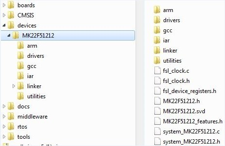

# System-on-Chip \(SoC\) files

SoC source/header files are in the following directory, which are available by default from MCUXpresso SDK.

|

|

**Note:**

Linker files for each toolchain are in the linker directory.

Different toolchains’ SoC startup assembler files are in the Arm, GCC, and IAR directories.

**Parent topic:**[Porting to a new platform](../topics/porting_to_a_new_platform.md)

