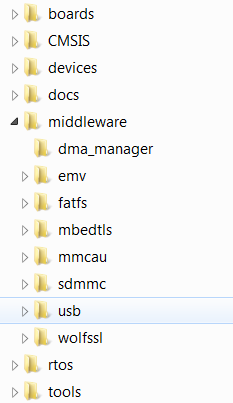
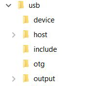

# USB code structure

The USB code is located in the folder:

*<install\_dir\>/middleware/usb*

|

|

The USB folder includes the source code for stack and examples. Note that the version number of the USB folder may vary.

|

|

The USB folder includes the following subfolders:

-   device

    This subfolder includes the device controller driver and common device driver for the USB device.

-   host

    This subfolder includes the host controller driver and common host driver for the USB host.

-   include

    This subfolder includes the definitions and structures for the USB stack.

-   otg

    This subfolder includes the OTG controller driver, common OTG driver and OTG peripheral driver for the USB OTG.

-   output

    This subfolder includes the files that are specially used by the New Project wizard.

**Note:** For different USB stack versions, the folder structure may be a little different. See the folder structure in the release package to get the exact folder structure.

**Parent topic:**[Build the USB examples in MCUXpresso SDK](../topics/build_the_usb_examples_in_mcuxpresso_sdk.md)

